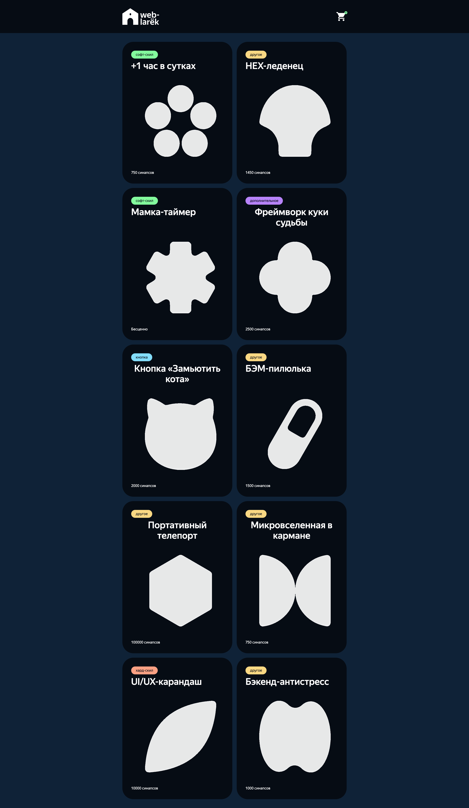

# Web Larek Frontend

## Table of Contents

1. [Project Description](#project-description)
2. [MVP Pattern Implementation](#mvp-pattern-implementation)
   - [Overview](#overview)
   - [Communication Flow](#communication-flow)
   - [Benefits](#benefits)
3. [Key Features](#key-features)
4. [Technical Stack](#technical-stack)
5. [Getting Started](#getting-started)
   - [Installation](#installation)
   - [Development Setup](#development-setup)
6. [Project Structure](#project-structure)
7. [Class Documentation](#class-documentation)
   - [Base Classes](#base-classes)
   - [Models](#models)
   - [Views](#views)
   - [Presenters](#presenters)
8. [Event System](#event-system)
   - [Cart Events](#-cart-events)
   - [Modal Events](#-modal-events)
   - [Product Events](#️-product-events)
   - [Form Events](#-form-events)
9. [API Layer](#api-layer)
10. [Development Guidelines](#development-guidelines)
    - [Component Development](#component-development)
    - [Code Style](#code-style)
    - [Testing](#testing)
11. [User Interaction Examples](#user-interaction-examples)
    - [Adding Product to Cart](#1-adding-product-to-cart)
    - [Form Validation During Checkout](#2-form-validation-during-checkout)
    - [Opening Product Details Modal](#3-opening-product-details-modal)

---

## Project Description

A merchandise store for developers where users can spend "synapses" (virtual currency) on developer-themed items. Built using TypeScript and MVP architecture, featuring a responsive gallery, shopping cart functionality, and form validation.

🔗 **Live version**: https://olliekse.github.io/web-larek-frontend/

---

## MVP Pattern Implementation

This project implements the Model-View-Presenter (MVP) architectural pattern to separate concerns and improve maintainability:

### Overview

The application is divided into three main layers:

1. **Model Layer**: Handles business logic and data management

   - Manages application state
   - Handles data validation
   - Emits state change events

2. **View Layer**: Handles UI rendering and user interactions

   - Renders UI components
   - Captures user input
   - Emits user interaction events

3. **Presenter Layer**: Coordinates between Models and Views
   - Handles business logic
   - Updates Models based on View events
   - Updates Views based on Model changes

### Communication Flow

1. **User → View**: User interacts with UI elements
2. **View → Presenter**: View emits events that Presenter handles
3. **Presenter → Model**: Presenter calls Model methods to update data
4. **Model → Presenter**: Model emits events with updated state
5. **Presenter → View**: Presenter updates View with new data

### Benefits

1. **Separation of Concerns**

   - Clear boundaries between layers
   - Each layer has a single responsibility

2. **Testability**

   - Components can be tested in isolation
   - Easy to mock dependencies

3. **Maintainability**

   - Changes in one layer don't affect others
   - Clear responsibility boundaries

4. **Reusability**
   - Components can be reused across features
   - Flexible architecture for future changes

For detailed implementation of each component, see [Class Documentation](#class-documentation).
For event system details, see [Core Concepts - Event System](#event-system).

---

## Key Features

- 🎨 Responsive product gallery with dynamic updates
- 🛒 Real-time cart management with synapse currency
- 📝 Multi-step order form with validation
- 🔄 State management with event-driven updates
- 💳 Multiple payment methods (card/cash)
- 📱 Mobile-friendly design
- 🔌 Type-safe API communication with error handling

---

## Technical Stack

- **TypeScript** - Main programming language
- **SCSS** - Styling with BEM methodology
- **Webpack** - Module bundling and development server
- **Event-Driven Architecture** - Custom event system for component communication
- **MVP Pattern** - Model-View-Presenter architectural pattern

---

## Getting Started

### Installation

```bash
# Install dependencies
npm install

# Start development server
npm run start

# Build for production
npm run build
```

### Development Setup

```bash
# Clone repository
git clone https://github.com/olliekse/web-larek-frontend.git

# Install dependencies
npm install

# Start development server
npm run start

# Build for production
npm run build

# Run tests
npm run test

# Lint code
npm run lint
```

---

## Project Structure

```
web-larek-frontend/
├── src/
│   ├── components/        # Application components
│   ├── services/         # Service layer implementations
│   ├── utils/            # Utility functions and helpers
│   ├── common.blocks/    # Common block components
│   ├── config/           # Configuration files
│   ├── constants/        # Constants and enums
│   ├── images/           # Image assets
│   ├── pages/            # Page templates
│   ├── public/           # Public assets
│   ├── scss/            # SCSS styles
│   ├── types/           # TypeScript type definitions
│   ├── vendor/          # Third-party libraries
│   └── index.ts         # Application entry point
```

## Class Documentation

### Base Classes

1. **BasePresenter**

   - **Purpose**: Serves as the foundation for all presenters in the MVP pattern, providing common event handling and lifecycle management functionality. Acts as a bridge between Models and Views.
   - **Fields**:
     - `protected events: IEvents` - Event system instance
   - **Methods**:
     - `constructor(events: IEvents)` - Initialises presenter with event system
     - `protected init(): void` - Template method for initialisation
     - `protected destroy(): void` - Cleanup and event unsubscription

2. **Card**

   - **Purpose**: Provides a reusable foundation for all product card components, handling common DOM manipulation, template management, and category styling. Ensures consistent card rendering across the application.
   - **Fields**:
     - `protected elements: CardElements` - DOM element references
     - `protected template: HTMLTemplateElement` - Card template
     - `protected domService: IDOMService` - DOM manipulation service
   - **Methods**:
     - `protected initializeElements(): void` - Sets up DOM element references
     - `render(data: IProduct): HTMLElement` - Creates card element
     - `protected getCategoryClass(category: string): string` - Maps category to CSS class

3. **EventEmitter**
   - **Purpose**: Implements a robust event system that enables decoupled communication between components. Manages event subscription, unsubscription, and emission throughout the application lifecycle.
   - **Fields**:
     - `private events: Record<string, EventHandler[]>` - Event handler storage
   - **Methods**:
     - `on(event: string, handler: EventHandler): void` - Subscribes to event
     - `off(event: string, handler: EventHandler): void` - Unsubscribes from event
     - `emit(event: string, data?: unknown): void` - Triggers event handlers
     - `trigger(event: string): Function` - Creates event trigger function

### Models

1. **StateService**

   - **Purpose**: Acts as a central state management system for the entire application, maintaining product data, cart state, loading states, and modal visibility. Ensures consistent state updates and notifications across components.
   - **Fields**:
     - `private products: IProduct[]` - Product list storage
     - `private cart: CartState` - Cart state storage
     - `private loading: Record<string, boolean>` - Loading states
     - `private modal: ModalState | null` - Modal state
   - **Methods**:
     - `setProducts(products: IProduct[]): void` - Updates product list
     - `getProducts(): IProduct[]` - Retrieves product list
     - `addToCart(product: IProduct): void` - Adds product to cart
     - `removeFromCart(productId: string): void` - Removes cart item
     - `getCart(): CartState` - Gets current cart state
     - `synchroniseState(): void` - Synchronises state with cart

2. **FormModel**

   - **Purpose**: Handles all aspects of form data management and validation, including field value tracking, error management, and validation rule enforcement. Provides a reliable foundation for form-based features.
   - **Fields**:
     - `private data: Partial<IOrderForm>` - Form field values
     - `private errors: FormErrors` - Validation error messages
     - `private validators: Record<string, ValidatorFn>` - Field validators
   - **Methods**:
     - `setField(field: keyof IOrderForm, value: string): void` - Updates field value
     - `validateField(field: keyof IOrderForm): boolean` - Validates single field
     - `validateForm(): boolean` - Validates entire form
     - `getErrors(): FormErrors` - Gets validation errors
     - `resetForm(): void` - Clears form data and errors
     - `validateBehaviour(): void` - Validates form data

3. **OrderModel**
   - **Purpose**: Manages the complete order lifecycle, from item collection to payment method selection and contact information. Ensures order data integrity and validation before submission.
   - **Fields**:
     - `private orderData: IOrder` - Current order data
     - `private items: string[]` - Order item IDs
     - `private paymentMethod: PaymentMethod` - Selected payment method
   - **Methods**:
     - `setOrderItems(items: IProduct[]): void` - Updates order items
     - `setPaymentMethod(method: PaymentMethod): void` - Sets payment method
     - `setContactInfo(info: ContactInfo): void` - Updates contact details
     - `getOrderData(): IOrder` - Gets complete order data
     - `validateOrder(): boolean` - Validates order completeness

### Views

1. **CardPreview**

   - **Purpose**: Provides an interactive product display component that handles both gallery and modal views, managing product information presentation and user interactions with cart functionality.
   - **Constructor**:
     ```typescript
     constructor(
         template: HTMLTemplateElement,
         protected events: IEvents,
         protected domService: IDOMService,
         protected stateService: StateService,
         protected actions?: IActions
     )
     ```
   - **Fields**:
     - `protected elements: { card: HTMLElement }` - Base card element
     - `protected button: HTMLButtonElement` - Cart action button
     - `private currentProduct: IProduct` - Currently displayed product
   - **Methods**:
     - `protected initializeElements(): void` - Sets up card elements
     - `render(data: IProduct): HTMLElement` - Creates product card
     - `updateButtonState(isInCart: boolean, canBePurchased: boolean): void` - Updates button
     - `renderModal(data: IProduct): HTMLElement` - Creates modal view

2. **Cart**

   - **Purpose**: Delivers a comprehensive shopping cart interface that manages item display, total calculation, and checkout process initiation. Provides real-time updates of cart state.
   - **Fields**:
     - `protected _list: HTMLElement` - Container for cart items
     - `protected _total: HTMLElement` - Display for total price
     - `protected _button: HTMLButtonElement` - Checkout action button
     - `private _counter: HTMLElement` - Cart item counter in header
   - **Methods**:
     - `render(): HTMLElement` - Renders cart container
     - `renderItems(items: IProduct[]): void` - Updates cart items display
     - `renderSumAllProducts(total: number): void` - Updates total price
     - `renderHeaderCartCounter(count: number): void` - Updates cart counter

3. **OrderForm**

   - **Purpose**: Facilitates the order completion process with address input, payment method selection, and form validation. Guides users through the checkout flow with appropriate feedback.
   - **Fields**:
     - `private _addressInput: HTMLInputElement` - Delivery address input
     - `private _paymentButtons: HTMLButtonElement[]` - Payment method selection
     - `private _submitButton: HTMLButtonElement` - Order submission button
     - `private _errorDisplay: HTMLElement` - Validation error messages
   - **Methods**:
     - `validateAddress(): boolean` - Checks address validity
     - `setPaymentMethod(method: string): void` - Updates payment selection
     - `private handleSubmit(): void` - Processes form submission
     - `showSuccess(): void` - Displays success message

4. **ModalView**

   - **Purpose**: Implements a flexible modal window system that can display various types of content with consistent styling and behavior. Manages modal lifecycle and content updates.
   - **Fields**:
     - `private container: HTMLElement` - Modal container
     - `private closeButton: HTMLButtonElement` - Modal close button
     - `private content: HTMLElement` - Content container
     - `private title: HTMLElement` - Modal title element
   - **Methods**:
     - `open(content: HTMLElement, title?: string): void` - Opens modal with content
     - `close(): void` - Closes modal window
     - `setContent(content: HTMLElement): void` - Updates modal content
     - `centreContent(): void` - Centres modal content

5. **ContactsForm**
   - **Purpose**: Handles user contact information collection with comprehensive validation for email and phone inputs. Ensures data quality before order submission.
   - **Fields**:
     - `private _emailInput: HTMLInputElement` - Email input field
     - `private _phoneInput: HTMLInputElement` - Phone input field
     - `private _submitButton: HTMLButtonElement` - Form submission button
     - `private _errorContainer: HTMLElement` - Error message display
   - **Methods**:
     - `validateEmail(email: string): boolean` - Checks email format
     - `validatePhone(phone: string): boolean` - Validates phone number
     - `private handleInput(field: string, value: string): void` - Processes input changes
     - `resetForm(): void` - Clears form data

### Presenters

1. **ProductPresenter**

   - **Purpose**: Orchestrates product catalog functionality, managing product display, state updates, and user interactions. Coordinates between product data and visual representation.
   - **Fields**:
     - `private gallery: HTMLElement` - Product gallery container
     - `private stateService: StateService` - State management service
     - `private api: ProductApi` - Product API service
   - **Methods**:
     - `async init(): Promise<void>`
       - Initialises product display
       - Fetches products from API
       - Emits: `state:products:changed`
     - `private handleProductSelect(product: IProduct): void`
       - Opens product detail modal
       - Parameters:
         - `product`: Selected product
       - Emits: `modal:open`
     - `private updateProductStates(): void`
       - Updates product button states
       - Synchronises with cart state
       - Updates UI elements

2. **CartPresenter**

   - **Purpose**: Coordinates all shopping cart operations, managing state updates, item removal, and cart display. Ensures synchronization between cart view and underlying data.
   - **Fields**:
     - `private stateService: StateService` - State management
     - `private view: ICart` - Cart view interface
     - `private modal: ModalView` - Modal window service
   - **Methods**:
     - `init(): void`
       - Sets up cart listeners
       - Initialises cart state
       - Updates cart counter
     - `private handleCartOpen(): void`
       - Opens cart modal
       - Updates cart display
       - Emits: `modal:open`
     - `private handleItemRemove(productId: string): void`
       - Removes item from cart
       - Updates cart state
       - Emits: `state:cart:changed`

3. **OrderPresenter**

   - **Purpose**: Manages the complete order submission flow, coordinating form validation, data collection, and API communication. Ensures a smooth checkout experience.
   - **Fields**:
     - `private formModel: FormModel` - Order form data
     - `private api: ProductApi` - API service
     - `private stateService: StateService` - State management
   - **Methods**:
     - `init(): void`
       - Sets up form listeners
       - Initialises validation
       - Prepares order flow
     - `private handleSubmit(formData: IOrderForm): void`
       - Processes order submission
       - Validates form data
       - Calls API to create order
       - Emits: `order:success`
     - `private validateOrder(): boolean`
       - Checks order validity
       - Validates all fields
       - Returns: Validation result

4. **ModalPresenter**

   - **Purpose**: Controls modal window lifecycle and content management, coordinating between different views that require modal display. Manages modal state and transitions.
   - **Fields**:
     - `private view: ModalView` - Modal view instance
     - `private currentContent: HTMLElement | null` - Currently displayed content
     - `private isOpen: boolean` - Modal state tracker
   - **Methods**:
     - `init(): void`
       - Sets up modal event listeners
       - Initialises view state
       - Subscribes to events
     - `private handleOpen(content: HTMLElement, title?: string): void`
       - Opens modal with content
       - Parameters:
         - `content`: Content to display
         - `title`: Optional modal title
       - Emits: `modal:opened`
     - `private handleClose(): void`
       - Closes modal window
       - Cleans up content
       - Emits: `modal:closed`

5. **ContactsPresenter**

   - **Purpose**: Coordinates contact information collection and validation, managing form state and user input validation. Ensures valid contact data before order processing.
   - **Fields**:
     - `private formModel: FormModel` - Form data model
     - `private view: ContactsForm` - Contact form view
     - `private api: ProductApi` - API service
   - **Methods**:
     - `init(): void`
       - Sets up form validation
       - Initialises event handlers
       - Prepares form state
     - `private handleSubmit(data: ContactInfo): void`
       - Processes form submission
       - Parameters:
         - `data`: Contact form data
       - Validates input
       - Emits: `contacts:valid`
     - `private validateForm(): boolean`
       - Performs form validation
       - Checks all required fields
       - Returns: Overall validity

6. **AppPresenter**
   - **Purpose**: Serves as the main application coordinator, initializing and managing all other presenters. Handles global state, error management, and high-level application flow.
   - **Fields**:
     - `private productPresenter: ProductPresenter` - Product management
     - `private cartPresenter: CartPresenter` - Cart operations
     - `private orderPresenter: OrderPresenter` - Order processing
     - `private modalPresenter: ModalPresenter` - Modal management
     - `private stateService: StateService` - Global state
   - **Methods**:
     - `async init(): Promise<void>`
       - Initialises all presenters
       - Sets up global event handlers
       - Loads initial data
     - `private setupEventHandlers(): void`
       - Configures global event system
       - Sets up inter-presenter communication
       - Handles global state changes
     - `private handleError(error: Error): void`
       - Global error handler
       - Shows error messages
       - Logs errors appropriately
     - `private loadInitialData(): Promise<void>`
       - Fetches initial application data
       - Updates global state
       - Initialises views

## Event System

#### 🛒 Cart Events

- `cart:open` - Open cart modal
- `cart:changed` - Cart contents have changed
- `cart:removeItem` - Request to remove item from cart
- `cart:state:get` - Request current cart state

#### 🔲 Modal Events

- `modal:open` - Open modal window with content
- `modal:close` - Close modal window
- `modal:update` - Update modal content

#### 🏷️ Product Events

- `card:select` - Product card selected
- `card:addCart` - Request to add product to cart

#### 📝 Form Events

- `order:ready` - Order form is valid and ready
- `order:submit` - Order form submitted
- `order:open` - Open order form
- `order:paymentSelection` - Payment method selected

## API Layer

The API layer is implemented using a base API client class that handles:

- Type-safe request/response handling
- Error management
- Authentication
- Response transformation

Key features of the API layer:

- Centralised error handling with typed errors
- Generic request/response typing
- Clean separation between base functionality and specific implementations
- Consistent error handling across all API calls

## Development Guidelines

1. **Component Development**

   - Follow MVP pattern
   - Use TypeScript interfaces
   - Implement event-driven communication

2. **Code Style**

   - Use consistent naming conventions
   - Document public methods and interfaces
   - Follow SOLID principles

3. **Testing**
   - Write unit tests for business logic
   - Test component integration
   - Validate event handling

## User Interaction Examples

Here are three common user interactions demonstrating the MVP pattern flow:

### 1. Adding Product to Cart

#### View (User Interaction)

```typescript
class CardView extends Card {
	protected initializeElements(): void {
		this.button.addEventListener('click', (e: Event) => {
			e.preventDefault();
			this.events.emit('card:addCart', this.currentProduct);
		});
	}
}
```

#### Presenter (Business Logic)

```typescript
class ProductPresenter extends BasePresenter {
	constructor(private stateService: StateService, private view: CardView) {
		super();
		this.events.on('card:addCart', this.handleAddToCart.bind(this));
	}

	private handleAddToCart(product: IProduct): void {
		this.stateService.addToCart(product);
		this.updateButtonState(product.id, true);
	}
}
```

#### Model (State Update)

```typescript
class StateService {
	addToCart(product: IProduct): void {
		this.cart.push(product);
		this.events.emit('state:cart:changed', {
			items: this.cart,
			total: this.calculateTotal(),
		});
	}
}
```

### 2. Form Validation During Checkout

#### View (User Input)

```typescript
class ContactsForm {
	constructor() {
		this._emailInput.addEventListener('input', (e: Event) => {
			const email = (e.target as HTMLInputElement).value;
			this.events.emit('form:email:input', email);
		});
	}
}
```

#### Presenter (Validation Logic)

```typescript
class OrderPresenter extends BasePresenter {
	constructor(private formModel: FormModel, private view: ContactsForm) {
		super();
		this.events.on('form:email:input', this.handleEmailInput.bind(this));
	}

	private handleEmailInput(email: string): void {
		const isValid = this.formModel.validateEmail(email);
		this.view.showEmailValidation(isValid);
		this.checkFormValidity();
	}
}
```

#### Model (Validation Rules)

```typescript
class FormModel {
	validateEmail(email: string): boolean {
		const emailRegex = /^[^\s@]+@[^\s@]+\.[^\s@]+$/;
		const isValid = emailRegex.test(email);
		this.events.emit('validation:email', {
			isValid,
			field: 'email',
			message: isValid ? '' : 'Invalid email format',
		});
		return isValid;
	}
}
```

### 3. Opening Product Details Modal

#### View (Gallery Interaction)

```typescript
class CardView extends Card {
	protected initializeElements(): void {
		this.elements.card.addEventListener('click', () => {
			this.events.emit('card:select', this.currentProduct);
		});
	}

	renderModal(product: IProduct): HTMLElement {
		return this.templator.compile(product, 'modal-card');
	}
}
```

#### Presenter (Modal Coordination)

```typescript
class ProductPresenter extends BasePresenter {
	constructor(private modalPresenter: ModalPresenter, private view: CardView) {
		super();
		this.events.on('card:select', this.handleProductSelect.bind(this));
	}

	private handleProductSelect(product: IProduct): void {
		const modalContent = this.view.renderModal(product);
		this.events.emit('modal:open', {
			content: modalContent,
			title: product.title,
		});
	}
}
```

#### Model (State Management)

```typescript
class StateService {
	setModalProduct(product: IProduct): void {
		this.currentModalProduct = product;
		this.events.emit('state:modal:product', {
			product,
			isInCart: this.isProductInCart(product.id),
		});
	}
}
```

Each example demonstrates:

- Clear separation of concerns (MVP pattern)
- Event-driven communication
- Unidirectional data flow
- State management
- User feedback

---

## Screenshot



The screenshot shows the main interface of the Web Larek store, featuring:

- Responsive product gallery
- Category-based styling
- Interactive cart functionality
- Clean, modern design
