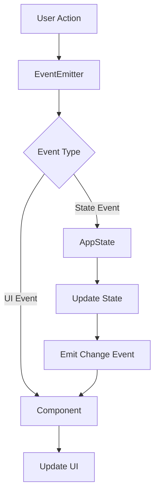
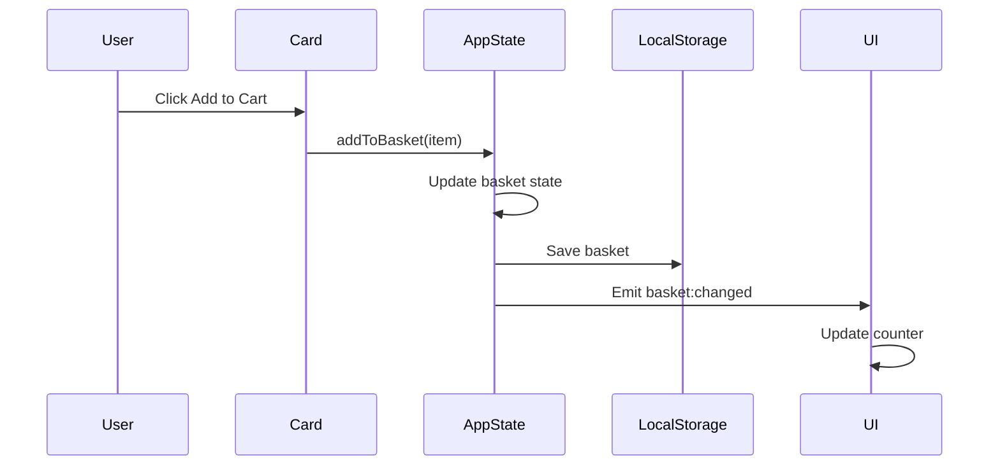

# Web Larek Frontend

A TypeScript-based web application for a developer merchandise store where users can browse and purchase items using a virtual currency called "synapse". This project demonstrates modern frontend development practices using TypeScript, Event-Driven Architecture, and component-based design.

🔗 **Live Demo**: [Web Larek Frontend](https://olliekse.github.io/web-larek-frontend/)


_Screenshot of the Web Larek store showing various developer merchandise items with their prices in synapses_

## Features

- 🎨 Interactive product catalog with categories
- 🛒 Real-time shopping cart with localStorage persistence
- 💳 Multi-step checkout process
- 📱 Responsive design
- 🔍 Modal product previews
- ✨ Clean and modern UI

## Tech Stack

- **TypeScript** (^5.0.4) - Main programming language
- **Webpack** (^5.81.0) - Module bundling and development
- **SCSS** (^1.62.1) - Styling (with BEM methodology)
- **Event-Driven Architecture** - For component communication
- **LocalStorage** - For cart persistence

## Getting Started

### Prerequisites

- Node.js (v16 or higher)
- npm or yarn

### Installation

1. Clone the repository:

```bash
git clone https://github.com/olliekse/web-larek-frontend.git
cd web-larek-frontend
```

2. Install dependencies:

```bash
npm install
# or
yarn install
```

3. Start the development server:

```bash
npm start
# or
yarn start
```

4. Build for production:

```bash
npm run build
# or
yarn build
```

### Available Scripts

- `npm start` - Starts development server
- `npm run build` - Builds for production
- `npm run lint` - Runs ESLint
- `npm run format` - Formats code with Prettier
- `npm run deploy` - Deploys to GitHub Pages

## Project Architecture

The project follows a component-based architecture with event-driven communication between components. Here's an overview of the main architectural elements:

This architecture is based on two key principles:

- **Component Isolation**: Each UI element (cards, forms, modals) is an independent module with its own logic and responsibility
- **Event-Driven Communication**: Components communicate through a centralized event system rather than direct references

For example, in a typical interaction:

1. The Card component emits an "add-to-basket" event when a product is selected
2. The AppData component handles the state change and emits a "basket:changed" event
3. The Basket component, subscribed to "basket:changed", updates its display accordingly

This pattern provides several benefits:

- Loose coupling between components
- Improved maintainability as components can be modified independently
- Clear data flow through the application
- Easier testing as component interactions are well-defined

### Class Diagram


_UML Class diagram showing the relationships and structure of the main components_

The diagram shows:

- **Component Hierarchy**: All UI components inherit from the base Component class
- **State Management**: AppData manages the application data and state changes
- **API Integration**: LarekAPI handles all backend communication
- **Event System**: EventEmitter enables communication between components
- **UI Components**: Card, Modal, Basket, and Form handle user interactions

### Component System

#### Base Components

##### EventEmitter

Core event handling system that enables component communication between all parts of the application. Supports pattern matching with RegExp for event names.

```typescript
type EventName = string | RegExp;
type Subscriber = Function;
type EmitterEvent = {
	eventName: string;
	data: unknown;
};

export interface IEvents {
	on<T extends object>(event: EventName, callback: (data: T) => void): void;
	emit<T extends object>(event: string, data?: T): void;
	trigger<T extends object>(
		event: string,
		context?: Partial<T>
	): (data: T) => void;
}

export class EventEmitter implements IEvents {
	_events: Map<EventName, Set<Subscriber>>;

	constructor() {
		this._events = new Map<EventName, Set<Subscriber>>();
	}

	// Set up event handler with support for string and RegExp patterns
	on<T extends object>(eventName: EventName, callback: (event: T) => void) {
		if (!this._events.has(eventName)) {
			this._events.set(eventName, new Set<Subscriber>());
		}
		this._events.get(eventName)?.add(callback);
	}

	// Remove event handler
	off(eventName: EventName, callback: Subscriber) {
		if (this._events.has(eventName)) {
			this._events.get(eventName)!.delete(callback);
			if (this._events.get(eventName)?.size === 0) {
				this._events.delete(eventName);
			}
		}
	}

	// Trigger event with data, supporting pattern matching
	emit<T extends object>(eventName: string, data?: T) {
		this._events.forEach((subscribers, name) => {
			if (name === '*')
				subscribers.forEach((callback) =>
					callback({
						eventName,
						data,
					})
				);
			if (
				(name instanceof RegExp && name.test(eventName)) ||
				name === eventName
			) {
				subscribers.forEach((callback) => callback(data));
			}
		});
	}

	// Listen to all events using wildcard
	onAll(callback: (event: EmitterEvent) => void) {
		this.on('*', callback);
	}

	// Reset all handlers
	offAll() {
		this._events = new Map<EventName, Set<Subscriber>>();
	}

	// Create a trigger callback that generates an event when called
	trigger<T extends object>(eventName: string, context?: Partial<T>) {
		return (event: object = {}) => {
			this.emit(eventName, {
				...(event || {}),
				...(context || {}),
			});
		};
	}
}
```

Key features:

- Pattern matching with RegExp for event names
- Wildcard event listening with '\*'
- Type-safe event data handling
- Event context support in triggers

##### Component

Abstract base class for all UI components in the application. Provides common functionality for rendering and event handling with robust type safety and error checking.

```typescript
export abstract class Component<T> {
	/** The root DOM element of the component */
	protected container: HTMLElement;
	/** Event emitter for component communication */
	protected events: IEvents;

	/**
	 * Creates a new component instance
	 * @param {HTMLElement} container - The root element for this component
	 * @param {IEvents} [events] - Optional event emitter for component communication
	 */
	constructor(container: HTMLElement, events?: IEvents) {
		this.container = container;
		this.events = events;
	}

	/**
	 * Sets the text content of an HTML element with null checking
	 */
	protected setText(element: HTMLElement, value: unknown) {
		if (element) {
			element.textContent = String(value);
		}
	}

	/**
	 * Sets the source and alt text of an image element with validation
	 */
	protected setImage(element: HTMLImageElement, src: string, alt?: string) {
		if (element) {
			element.src = src;
			if (alt) {
				element.alt = alt;
			}
		}
	}

	/**
	 * Sets or removes the disabled attribute of an HTML element
	 */
	protected setDisabled(element: HTMLElement, state: boolean) {
		if (element) {
			if (state) {
				element.setAttribute('disabled', 'disabled');
			} else {
				element.removeAttribute('disabled');
			}
		}
	}

	/**
	 * Emits an event through the component's event emitter with type safety
	 */
	protected emit(event: string, payload?: object) {
		if (this.events) {
			this.events.emit(event, payload);
		}
	}

	/**
	 * Renders the component with the provided data
	 * Must be implemented by each component class
	 */
	abstract render(data?: Partial<T>): HTMLElement;
}
```

Key features:

- Generic type parameter for component data
- Null checking and validation for DOM operations
- Type-safe event emission
- Protected helper methods for common DOM operations

##### Model

Base class for all data models in the application. Implements state management with type-safe updates and event emission.

```typescript
/**
 * Type guard to check if an object is an instance of Model
 */
export const isModel = (obj: unknown): obj is Model<any> => {
	return obj instanceof Model;
};

export abstract class Model<T> {
	/** Event emitter for model state changes */
	protected events: IEvents;
	/** Internal state storage */
	private state: T;

	/**
	 * Creates a new model instance
	 * @param {Partial<T>} data - Initial state data
	 * @param {IEvents} events - Event emitter for state changes
	 */
	constructor(data: Partial<T>, events: IEvents) {
		this.state = data as T;
		this.events = events;
	}

	/**
	 * Gets the current state of the model
	 */
	public getState(): T {
		return this.state;
	}

	/**
	 * Updates the model's state
	 */
	protected updateState(newState: T) {
		this.state = newState;
	}

	/**
	 * Emits a state change event
	 */
	protected emitChanges(event: string) {
		this.events.emit(event);
	}
}
```

Key features:

- Generic type parameter for state data
- Type guard for runtime type checking
- Protected state mutation methods
- Event-driven state updates
- Immutable state pattern

Example implementation (AppData):

```typescript
export class AppData extends Model<IAppState> {
	// Action types for state mutations
	export enum ActionType {
		SET_CATALOG = 'SET_CATALOG',
		ADD_TO_BASKET = 'ADD_TO_BASKET',
		REMOVE_FROM_BASKET = 'REMOVE_FROM_BASKET',
		CLEAR_BASKET = 'CLEAR_BASKET',
		SET_PREVIEW = 'SET_PREVIEW',
		UPDATE_ORDER = 'UPDATE_ORDER',
	}

	private dispatch(
		type: ActionType,
		payload: IProduct[] | IProduct | string | OrderUpdatePayload | null
	) {
		// State updates with corresponding events
		const eventMap: Record<ActionType, string> = {
			[ActionType.SET_CATALOG]: 'items:changed',
			[ActionType.ADD_TO_BASKET]: 'basket:changed',
			[ActionType.REMOVE_FROM_BASKET]: 'basket:changed',
			[ActionType.CLEAR_BASKET]: 'basket:changed',
			[ActionType.SET_PREVIEW]: 'preview:changed',
			[ActionType.UPDATE_ORDER]: 'order:changed',
		};

		// Update state and emit change event
		this.updateState({
			...this.getState(),
			...newState,
		});
		this.emitChanges(eventMap[type]);
	}
}
```

#### Core Components

##### AppData

Central state management component that handles all application data. Manages product catalog, shopping basket, preview state, and order processing.

```typescript
class AppData extends Model<IAppState> {
	// Updates the product catalog and notifies subscribers
	setCatalog(items: IProduct[]): void;

	// Adds a product to the shopping basket
	addToBasket(item: IProduct): void;

	// Removes a product from the basket by ID
	removeFromBasket(id: string): void;

	// Clears all items from the basket
	clearBasket(): void;

	// Sets the product being previewed
	setPreview(item: IProduct | null): void;

	// Updates a specific field in the order form
	setOrderField(field: keyof IAppState['order'], value: string | number): void;

	// Validates the current order data
	validateOrder(): Partial<Record<keyof IAppState['order'], string>>;
}
```

##### Card

Component for displaying product information in various contexts. Handles different display modes: catalog view, preview, and basket item.

```typescript
class Card extends Component<ICard> {
	// Element displaying product title
	protected _title: HTMLElement;

	// Optional product image element
	protected _image?: HTMLImageElement;

	// Element showing product category
	protected _category?: HTMLElement;

	// Element displaying product price
	protected _price: HTMLElement;

	// Interactive button for card actions
	protected _button?: HTMLButtonElement;

	// Updates card's unique identifier
	set id(value: string);

	// Sets the product title
	set title(value: string);

	// Updates product image source
	set image(value: string);

	// Controls card's selected state
	set selected(value: boolean);

	// Manages card's disabled state
	set disabled(value: boolean);

	// Formats and displays product price
	protected setPrice(value: number | null): void;

	// Sets category and applies appropriate styling
	protected setCategory(value: string): void;

	// Renders card with provided product data
	render(data: ICard): HTMLElement;
}
```

##### PreviewCard

Extended version of Card component for detailed product views. Adds description display capability while maintaining all base card functionality.

```typescript
class PreviewCard extends Card {
	// Element for displaying detailed product description
	protected _description: HTMLElement;

	// Creates a preview card with description support
	constructor(container: HTMLElement, actions?: ICardActions);

	// Sets the product description text
	set description(value: string);

	// Updates description visibility
	protected setDescriptionVisible(visible: boolean): void;

	// Renders preview card with full product details
	render(data: ICard & { description?: string }): HTMLElement;
}
```

##### Modal

Modal window component for displaying overlay content. Handles opening, closing, and content management with proper scroll locking.

```typescript
class Modal extends Component<IModalData> {
	// Button for closing the modal
	protected _closeButton: HTMLButtonElement;

	// Container for modal's content
	protected _content: HTMLElement;

	// Outer container for modal positioning
	protected _container: HTMLElement;

	// Creates modal with close button and event handlers
	constructor(container: HTMLElement, events: IEvents);

	// Updates modal's content element
	set content(value: HTMLElement);

	// Opens modal and locks page scroll
	open(): void;

	// Closes modal and restores page scroll
	close(): void;

	// Renders modal with provided content
	render(data: IModalData): HTMLElement;
}
```

##### Form

Form component that handles user input validation and submission. Supports both order and contact information forms with real-time validation and error handling.

```typescript
interface IFormState {
	valid: boolean; // Whether the form is currently valid
	errors: string[]; // List of validation error messages
}

export class Form extends Component<IFormState> {
	protected _submit: HTMLButtonElement; // Form submit button
	protected _errors: HTMLElement; // Container for error messages
	protected _paymentButtons: NodeListOf<HTMLButtonElement>; // Payment method buttons
	protected _address: HTMLInputElement; // Delivery address input
	protected _email: HTMLInputElement; // Email input
	protected _phone: HTMLInputElement; // Phone number input
	protected _validationErrors: Set<string>; // Current validation errors
	protected _form: HTMLFormElement; // The form element itself

	constructor(container: HTMLElement, events: IEvents) {
		super(container, events);

		// Initialize form elements using ensureElement utility
		this._submit = ensureElement<HTMLButtonElement>(
			'.form__submit',
			this.container
		);
		this._errors = ensureElement<HTMLElement>('.form__errors', this.container);
		this._paymentButtons = this.container.querySelectorAll('.form__radio');
		this._address = ensureElement<HTMLInputElement>(
			'input[name="address"]',
			this.container
		);
		this._email = ensureElement<HTMLInputElement>(
			'input[name="email"]',
			this.container
		);
		this._phone = ensureElement<HTMLInputElement>(
			'input[name="phone"]',
			this.container
		);
		this._form = ensureElement<HTMLFormElement>('form', this.container);
		this._validationErrors = new Set();

		// Set up event listeners
		this._form.addEventListener('input', this.handleInput.bind(this));
		this._form.addEventListener('submit', this.handleSubmit.bind(this));
	}

	protected handleInput(event: Event) {
		const target = event.target as HTMLInputElement;
		const field = target.name;
		const value = target.value;

		this.emit('input', { field, value });
		this.validateForm();
	}

	protected handleSubmit(event: Event) {
		event.preventDefault();
		this.validateForm();
		if (this._validationErrors.size === 0) {
			this.emit('submit');
		}
	}

	set valid(value: boolean) {
		this.setDisabled(this._submit, !value);
	}

	set errors(value: string[]) {
		this._validationErrors = new Set(value);
		this.setText(this._errors, value.join(', '));
	}

	render(state: Partial<IFormState>): HTMLElement {
		const { valid, errors } = state;
		if (valid !== undefined) {
			this.valid = valid;
		}
		if (errors !== undefined) {
			this.errors = errors;
		}
		return this.container;
	}
}
```

Key features:

- Real-time input validation
- Error message management
- Payment method selection
- Form submission handling
- Type-safe event emission
- Utility function usage for safe element selection

##### Success

Component for displaying successful order completion. Shows order summary and confirmation details with close functionality.

```typescript
interface ISuccess {
	total: number; // Total amount spent in synapses
}

export class Success extends Component<ISuccess> {
	protected _close: HTMLElement; // Close button element
	protected _total: HTMLElement; // Element displaying total amount

	constructor(container: HTMLElement, events: IEvents) {
		super(container, events);

		// Initialize elements using ensureElement utility
		this._close = ensureElement<HTMLElement>(
			'.order-success__close',
			this.container
		);
		this._total = ensureElement<HTMLElement>(
			'.order-success__description',
			this.container
		);

		// Set up close button handler
		if (this._close) {
			this._close.addEventListener('click', () => {
				this.events.emit('success:close');
			});
		}
	}

	/**
	 * Updates the displayed total amount with currency formatting
	 */
	set total(total: number) {
		this.setText(this._total, `Списано ${total} синапсов`);
	}

	/**
	 * Renders the success message with the total amount
	 */
	render(data: ISuccess): HTMLElement {
		this.total = data.total;
		return this.container;
	}
}
```

Key features:

- Safe element selection with utility function
- Currency formatting for total amount
- Close button functionality
- Event emission on close
- Type-safe data handling

##### Basket

Shopping cart component that manages the display of selected items and total amount. Handles checkout process initiation.

```typescript
interface IBasketView {
	items: HTMLElement[]; // Array of rendered product elements
	total: number; // Total price in synapses
}

export class Basket extends Component<IBasketView> {
	protected _list: HTMLElement; // Container for cart items
	protected _total: HTMLElement; // Display for total price
	protected _button: HTMLButtonElement; // Checkout button

	constructor(container: HTMLElement, events: IEvents) {
		super(container, events);

		// Initialize elements using ensureElement utility
		this._list = ensureElement<HTMLElement>('.basket__list', this.container);
		this._total = ensureElement<HTMLElement>('.basket__price', this.container);
		this._button = ensureElement<HTMLButtonElement>(
			'.basket__button',
			this.container
		);

		// Set up checkout button handler
		if (this._button) {
			this._button.addEventListener('click', () => {
				events.emit('basket:checkout');
			});
		}
	}

	/**
	 * Updates the list of items in the cart
	 * Disables checkout button if cart is empty
	 */
	set items(items: HTMLElement[]) {
		this._list.replaceChildren(...items);
		this.setDisabled(this._button, items.length === 0);
	}

	/**
	 * Renders the basket with items and total
	 */
	render(data: IBasketView): HTMLElement {
		if (data.items) {
			this.items = data.items;
		}
		if (data.total !== undefined) {
			this.setText(this._total, `${data.total} синапсов`);
		}
		return this.container;
	}
}
```

Key features:

- Safe element selection with utility function
- Dynamic item list management
- Automatic button state management
- Currency formatting
- Checkout process initiation
- Type-safe event emission

##### Page

Main page component that orchestrates the layout and manages global UI elements. Handles catalog display, shopping cart counter, and page wrapper.

```typescript
interface IPage {
	counter: number; // Number of items in shopping cart
	catalog: HTMLElement[]; // Array of product card elements
}

export class Page extends Component<IPage> {
	protected _counter: HTMLElement; // Shopping cart counter element
	protected _catalog: HTMLElement; // Product gallery container
	protected _wrapper: HTMLElement; // Main page wrapper

	constructor(container: HTMLElement, events: IEvents) {
		super(container);

		// Initialize page elements
		this._counter = container.querySelector('.header__basket-counter');
		this._catalog = container.querySelector('.gallery');
		this._wrapper = container.querySelector('.page__wrapper');

		// Set up event listeners for counter and catalog updates
		if (events) {
			events.on('counter:changed', this.setCounter.bind(this));
			events.on('catalog:changed', this.setCatalog.bind(this));
		}
	}

	/**
	 * Updates the shopping cart counter display
	 */
	set counter(value: number) {
		this.setText(this._counter, value.toString());
	}

	/**
	 * Updates the product catalog display
	 * Replaces all current cards with new ones
	 */
	set catalog(items: HTMLElement[]) {
		this._catalog.replaceChildren(...items);
	}

	/**
	 * Event handler for counter updates
	 */
	protected setCounter(value: number) {
		this.counter = value;
	}

	/**
	 * Event handler for catalog updates
	 */
	protected setCatalog(items: HTMLElement[]) {
		this.catalog = items;
	}

	/**
	 * Renders the page with provided data
	 */
	render(data: Partial<IPage>): HTMLElement {
		if (data.counter !== undefined) {
			this.counter = data.counter;
		}
		if (data.catalog) {
			this.catalog = data.catalog;
		}
		return this.container;
	}
}
```

Key features:

- Automatic counter updates through event system
- Dynamic catalog management
- Page wrapper for layout control
- Event-driven updates for both counter and catalog

## Technical Reference

### Component Interactions

Below is a visualization of how components interact in different scenarios:



#### Example: Adding to Cart Flow



### Implementation Examples

#### 1. Product Preview and Catalog Handling

```typescript
// Stage 1: Initialize API and fetch product list
api
	.getProductList()
	.then((items) => {
		appData.setCatalog(items);
		const state = appData.getState();

		// Stage 2: Create card template for each product
		const cards = state.catalog.map((item) => {
			const cardElement = cardCatalogTemplate.content.cloneNode(
				true
			) as HTMLElement;

			// Stage 3: Set up click handler for preview
			const card = new Card(cardElement.firstElementChild as HTMLElement, {
				onClick: () => {
					appData.setPreview(item);
					modal.open();
				},
			});

			// Stage 4: Render card with product data
			return card.render({
				title: item.title,
				image: item.image,
				price: item.price,
				category: item.category,
			});
		});

		// Stage 5: Update page catalog with all cards
		page.catalog = cards;
	})
	.catch(console.error);
```

#### 2. Shopping Cart Management

```typescript
events.on('basket:changed', () => {
	// Stage 1: Get current state and update counter
	const state = appData.getState();
	page.counter = state.basket.length;

	// Stage 2: Create card elements for basket items
	const basketItems = state.basket.map((item) => {
		const cardElement = basketItemTemplate.content.cloneNode(
			true
		) as HTMLElement;

		// Stage 3: Set up delete functionality
		const card = new Card(cardElement.firstElementChild as HTMLElement, {
			onDelete: () => {
				appData.removeFromBasket(item.id);
			},
		});

		// Stage 4: Render individual basket item
		return card.render({
			title: item.title,
			price: item.price,
			category: item.category,
		});
	});

	// Stage 5: Update basket UI and persist to storage
	const basketTotal = state.basket.reduce((sum, item) => sum + item.price, 0);
	basketModal.render({
		content: basket.render({
			items: basketItems,
			total: basketTotal,
		}),
	});
	localStorage.setItem('basket', JSON.stringify(state.basket));
});
```

#### 3. Order Processing

```typescript
events.on('contacts:submit', (data: { email: string; phone: string }) => {
	// Stage 1: Update order fields with contact info
	appData.setOrderField('email', data.email);
	appData.setOrderField('phone', data.phone);

	// Stage 2: Prepare order data
	const state = appData.getState();
	const orderData = {
		...state.order,
		items: state.basket.map((item) => item.id),
		total: state.basket.reduce((sum, item) => sum + item.price, 0),
	};

	// Stage 3: Submit order to API
	api
		.createOrder(orderData)
		.then((result) => {
			// Stage 4: Handle successful order
			orderModal.close();
			successModal.render({
				content: success.render({
					total: result.total,
				}),
			});
			successModal.open();

			// Stage 5: Clean up after successful order
			appData.clearBasket();
		})
		.catch(console.error);
});
```

#### 4. Form Processing and Validation

```typescript
events.on('input', (data: { field: string; value: string }) => {
	// Stage 1: Check field type and update state
	if (
		data.field === 'email' ||
		data.field === 'phone' ||
		data.field === 'address'
	) {
		appData.setOrderField(data.field, data.value);
	}

	// Stage 2: Form validation
	const errors = appData.validateOrder();

	// Stage 3: Update form state
	orderForm.render({
		valid: Object.keys(errors).length === 0,
		errors: Object.values(errors),
	});
});
```

#### 5. Application Initialization

```typescript
// Stage 1: Create event system instance
const events = new EventEmitter();

// Stage 2: Initialize API client
const api = new LarekAPI(CDN_URL, API_URL);

// Stage 3: Initialize data store
const appData = new AppData({ basket: [] }, events);

// Stage 4: Restore basket from localStorage
const basketData = localStorage.getItem('basket');
if (basketData) {
	const basket = JSON.parse(basketData);
	basket.forEach((item: IProduct) => {
		appData.addToBasket(item);
	});
}

// Stage 5: Load initial data
api
	.getProductList()
	.then((items) => {
		appData.setCatalog(items);
	})
	.catch(console.error);
```

### Event System and API Reference

The application uses events for component communication. Here's the complete reference:

#### State Events

| Event Name      | Payload                                | Description                 |
| --------------- | -------------------------------------- | --------------------------- |
| items:changed   | `IProduct[]`                           | Product catalog updated     |
| preview:changed | `IProduct \| null`                     | Product preview set/cleared |
| basket:changed  | `{ items: IProduct[], total: number }` | Shopping cart modified      |
| order:changed   | `IOrder`                               | Order details updated       |

#### User Action Events

| Event Name      | Payload                                | Description               |
| --------------- | -------------------------------------- | ------------------------- |
| input           | `{ field: string, value: string }`     | Form field changed        |
| submit          | `{ payment: string, address: string }` | Order form submitted      |
| contacts:submit | `{ email: string, phone: string }`     | Contact details submitted |

### API Integration

#### Api

Base class for API communication. Provides methods for making HTTP requests and handling responses.

```typescript
/**
 * Generic type for API list responses
 */
export type ApiListResponse<Type> = {
	total: number;
	items: Type[];
};

/**
 * Valid HTTP methods for POST-like operations
 */
export type ApiPostMethods = 'POST' | 'PUT' | 'DELETE';

/**
 * Base API client class
 * Provides common functionality for making HTTP requests
 */
export class Api {
	/** Base URL for all API requests */
	readonly baseUrl: string;
	/** Default request options */
	protected options: RequestInit;

	/**
	 * Creates a new API client instance
	 * @param {string} baseUrl - Base URL for all API requests
	 * @param {RequestInit} [options={}] - Default fetch options
	 */
	constructor(baseUrl: string, options: RequestInit = {}) {
		this.baseUrl = baseUrl;
		this.options = {
			headers: {
				'Content-Type': 'application/json',
				...((options.headers as object) ?? {}),
			},
		};
	}

	/**
	 * Handles API response
	 * Automatically parses JSON and handles errors
	 */
	protected handleResponse(response: Response): Promise<object> {
		if (response.ok) return response.json();
		else
			return response
				.json()
				.then((data) => Promise.reject(data.error ?? response.statusText));
	}

	/**
	 * Makes a GET request to the API
	 */
	get(uri: string) {
		return fetch(this.baseUrl + uri, {
			...this.options,
			method: 'GET',
		}).then(this.handleResponse);
	}

	/**
	 * Makes a POST, PUT, or DELETE request to the API
	 */
	post(uri: string, data: object, method: ApiPostMethods = 'POST') {
		return fetch(this.baseUrl + uri, {
			...this.options,
			method,
			body: JSON.stringify(data),
		}).then(this.handleResponse);
	}
}

/**
 * API client for handling communication with the backend
 * Extends the base Api class with specific methods for the Web Larek store
 */
export class LarekAPI extends Api {
	readonly cdn: string;

	constructor(cdn: string, baseUrl: string, options?: RequestInit) {
		super(baseUrl, options);
		this.cdn = cdn;
	}

	/**
	 * Fetches the list of products from the API
	 * Adds CDN URL to product images
	 */
	getProductList(): Promise<IProduct[]> {
		return this.get('/product').then((data: ApiListResponse<IProduct>) =>
			data.items.map((item) => ({
				...item,
				image: this.cdn + item.image,
			}))
		);
	}

	/**
	 * Creates a new order in the system
	 */
	createOrder(order: IOrder): Promise<IOrderResult> {
		return this.post('/order', order).then((data: IOrderResult) => data);
	}
}
```

### Project Structure

```
src/
├── components/          # Core components
│   ├── base/           # Base classes
│   │   ├── Component.ts    # Base UI component
│   │   ├── events.ts      # Event system
│   │   └── Model.ts       # State management
│   ├── common/         # Shared components
│   ├── AppData.ts      # Application state
│   ├── Card.ts         # Product card component
│   ├── LarekAPI.ts     # API client
│   ├── Order.ts        # Order management
│   └── Page.ts         # Page layout
├── types/              # TypeScript definitions
│   ├── index.ts        # Type exports
│   ├── api.ts          # API types
│   └── common.ts       # Shared types
├── utils/              # Utility functions
│   ├── constants.ts    # Global constants
│   └── utils.ts        # Helper functions
└── index.ts           # Application entry point
```

## Development Guidelines

1. **Event Handling**

   - Use events for component communication
   - Keep event names consistent
   - Document event payloads

2. **State Management**

   - Modify state only through AppData
   - Use events to react to state changes
   - Persist necessary data to localStorage

3. **Component Development**

   - Keep components focused and single-purpose
   - Use TypeScript interfaces for props
   - Follow the established component lifecycle

4. **Code Style**
   - Use TypeScript features appropriately
   - Follow ESLint and Prettier configurations
   - Write clear, self-documenting code
