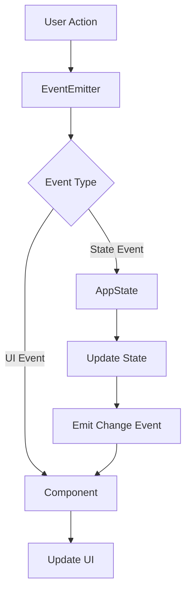
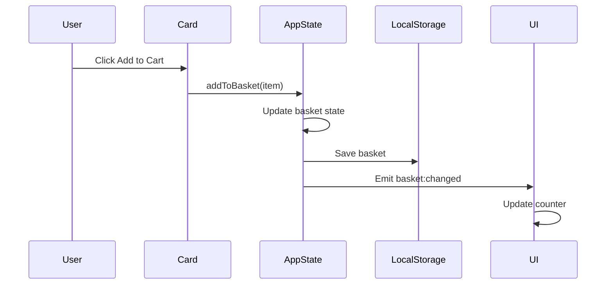

# Web Larek Frontend

A TypeScript-based web application for a developer merchandise store where users can browse and purchase items using a virtual currency called "synapse". This project demonstrates modern frontend development practices using TypeScript, Event-Driven Architecture, and component-based design.

🔗 **Live Demo**: [Web Larek Frontend](https://olliekse.github.io/web-larek-frontend/)


_Screenshot of the Web Larek store showing various developer merchandise items with their prices in synapses_

## Features

- 🎨 Interactive product catalog with categories
- 🛒 Real-time shopping cart with localStorage persistence
- 💳 Multi-step checkout process
- 📱 Responsive design
- 🔍 Modal product previews
- ✨ Clean and modern UI

## Tech Stack

- **TypeScript** (^5.0.4) - Main programming language
- **Webpack** (^5.81.0) - Module bundling and development
- **SCSS** (^1.62.1) - Styling (with BEM methodology)
- **Event-Driven Architecture** - For component communication
- **LocalStorage** - For cart persistence

## Getting Started

### Prerequisites

- Node.js (v16 or higher)
- npm or yarn

### Installation

1. Clone the repository:

```bash
git clone https://github.com/olliekse/web-larek-frontend.git
cd web-larek-frontend
```

2. Install dependencies:

```bash
npm install
# or
yarn install
```

3. Start the development server:

```bash
npm start
# or
yarn start
```

4. Build for production:

```bash
npm run build
# or
yarn build
```

### Available Scripts

- `npm start` - Starts development server
- `npm run build` - Builds for production
- `npm run lint` - Runs ESLint
- `npm run format` - Formats code with Prettier
- `npm run deploy` - Deploys to GitHub Pages

## Project Architecture

The project follows a component-based architecture with event-driven communication between components. Here's an overview of the main architectural elements:

This architecture is based on two key principles:

- **Component Isolation**: Each UI element (cards, forms, modals) is an independent module with its own logic and responsibility
- **Event-Driven Communication**: Components communicate through a centralized event system rather than direct references

For example, in a typical interaction:

1. The Card component emits an "add-to-basket" event when a product is selected
2. The AppData component handles the state change and emits a "basket:changed" event
3. The Basket component, subscribed to "basket:changed", updates its display accordingly

This pattern provides several benefits:

- Loose coupling between components
- Improved maintainability as components can be modified independently
- Clear data flow through the application
- Easier testing as component interactions are well-defined

### Class Diagram


_UML Class diagram showing the relationships and structure of the main components_

The diagram shows:

- **Component Hierarchy**: All UI components inherit from the base Component class
- **State Management**: AppData manages the application data and state changes
- **API Integration**: LarekAPI handles all backend communication
- **Event System**: EventEmitter enables communication between components
- **UI Components**: Card, Modal, Basket, and Form handle user interactions

### Component System

#### Base Components

##### EventEmitter

Core event handling system that enables component communication between all parts of the application.

```typescript
class EventEmitter {
	// Map of event names to callback functions
	private events: Map<string, Set<Callback>>;

	// Registers a callback for a specific event
	on(event: string, callback: Function): void;

	// Removes a registered callback
	off(event: string, callback: Function): void;

	// Triggers an event with optional data
	emit(event: string, data?: any): void;
}
```

##### Component

Abstract base class for all UI components in the application. Provides common functionality for rendering and event handling.

```typescript
abstract class Component<T> {
	// Root DOM element
	protected container: HTMLElement;

	// Event system reference
	protected events: IEvents;

	// Updates text content safely
	protected setText(element: HTMLElement, value: unknown): void;

	// Sets image source with error handling
	protected setImage(
		element: HTMLImageElement,
		src: string,
		alt?: string
	): void;

	// Manages disabled state
	protected setDisabled(element: HTMLElement, state: boolean): void;

	// Emits events through the event system
	protected emit(event: string, payload?: object): void;

	// Renders component content
	abstract render(data?: T): HTMLElement;
}
```

##### Model

Base class for all data models in the application. Implements state management with type-safe updates.

```typescript
abstract class Model<T> {
	// Event system for broadcasting state changes
	protected events: IEvents;

	// Type-safe state container
	private state: T;

	// Creates a new model with initial state and event system
	constructor(data: Partial<T>, events: IEvents);

	// Retrieves the current state
	public getState(): T;

	// Updates the state with new data
	protected updateState(newState: T): void;

	// Notifies subscribers about state changes
	protected emitChanges(event: string): void;
}
```

#### Core Components

##### AppData

Central state management component that handles all application data. Manages product catalog, shopping basket, preview state, and order processing.

```typescript
class AppData extends Model<IAppState> {
	// Updates the product catalog and notifies subscribers
	setCatalog(items: IProduct[]): void;

	// Adds a product to the shopping basket
	addToBasket(item: IProduct): void;

	// Removes a product from the basket by ID
	removeFromBasket(id: string): void;

	// Clears all items from the basket
	clearBasket(): void;

	// Sets the product being previewed
	setPreview(item: IProduct | null): void;

	// Updates a specific field in the order form
	setOrderField(field: keyof IAppState['order'], value: string | number): void;

	// Validates the current order data
	validateOrder(): Partial<Record<keyof IAppState['order'], string>>;
}
```

##### Card

Component for displaying product information in various contexts. Handles different display modes: catalog view, preview, and basket item.

```typescript
class Card extends Component<ICard> {
	// Element displaying product title
	protected _title: HTMLElement;

	// Optional product image element
	protected _image?: HTMLImageElement;

	// Element showing product category
	protected _category?: HTMLElement;

	// Element displaying product price
	protected _price: HTMLElement;

	// Interactive button for card actions
	protected _button?: HTMLButtonElement;

	// Updates card's unique identifier
	set id(value: string);

	// Sets the product title
	set title(value: string);

	// Updates product image source
	set image(value: string);

	// Controls card's selected state
	set selected(value: boolean);

	// Manages card's disabled state
	set disabled(value: boolean);

	// Formats and displays product price
	protected setPrice(value: number | null): void;

	// Sets category and applies appropriate styling
	protected setCategory(value: string): void;

	// Renders card with provided product data
	render(data: ICard): HTMLElement;
}
```

##### PreviewCard

Extended version of Card component for detailed product views. Adds description display capability while maintaining all base card functionality.

```typescript
class PreviewCard extends Card {
	// Element for displaying detailed product description
	protected _description: HTMLElement;

	// Creates a preview card with description support
	constructor(container: HTMLElement, actions?: ICardActions);

	// Sets the product description text
	set description(value: string);

	// Updates description visibility
	protected setDescriptionVisible(visible: boolean): void;

	// Renders preview card with full product details
	render(data: ICard & { description?: string }): HTMLElement;
}
```

##### Modal

Modal window component for displaying overlay content. Handles opening, closing, and content management with proper scroll locking.

```typescript
class Modal extends Component<IModalData> {
	// Button for closing the modal
	protected _closeButton: HTMLButtonElement;

	// Container for modal's content
	protected _content: HTMLElement;

	// Outer container for modal positioning
	protected _container: HTMLElement;

	// Creates modal with close button and event handlers
	constructor(container: HTMLElement, events: IEvents);

	// Updates modal's content element
	set content(value: HTMLElement);

	// Opens modal and locks page scroll
	open(): void;

	// Closes modal and restores page scroll
	close(): void;

	// Renders modal with provided content
	render(data: IModalData): HTMLElement;
}
```

##### Form

Form component that handles user input validation and submission. Supports both order and contact information forms with real-time validation.

```typescript
class Form extends Component<IFormState> {
	// Submit button that triggers form submission
	protected _submit: HTMLButtonElement;

	// Container for validation error messages
	protected _errors: HTMLElement;

	// Collection of payment method selection buttons
	protected _paymentButtons: NodeListOf<HTMLButtonElement>;

	// Input fields for user data
	protected _address: HTMLInputElement;
	protected _email: HTMLInputElement;
	protected _phone: HTMLInputElement;

	// Set of current validation errors
	protected _validationErrors: Set<string>;

	// Main form element reference
	protected _form: HTMLFormElement;

	// Creates form instance and sets up validation handlers
	constructor(container: HTMLElement, events: IEvents);

	// Validates all form fields and updates state
	protected validateForm(): void;

	// Handles input field changes with validation
	protected handleInput(event: Event): void;

	// Processes form submission with validation
	protected handleSubmit(event: Event): void;

	// Updates submit button state based on validity
	set valid(value: boolean);

	// Updates error message display
	set errors(value: string[]);

	// Renders form with current state
	render(state: IFormState): HTMLElement;
}
```

##### Success

Component for displaying successful order completion. Shows order summary and confirmation details.

```typescript
class Success extends Component<ISuccessProps> {
	// Element displaying total amount
	protected _total: HTMLElement;

	// Element showing order identifier
	protected _id: HTMLElement;

	// Creates success message component
	constructor(container: HTMLElement);

	// Sets the total amount with proper formatting
	protected setTotal(value: number): void;

	// Sets the order identifier
	protected setId(value: string): void;

	// Renders success message with order details
	render(data: ISuccessProps): HTMLElement;
}
```

##### Basket

Shopping cart component that manages the display of selected items and total amount.

```typescript
class Basket extends Component<IBasketView> {
	// Counter showing number of items
	protected _counter: HTMLElement;

	// Element displaying total amount
	protected _total: HTMLElement;

	// Container for basket items
	protected _items: HTMLElement;

	// Creates basket component with event handlers
	constructor(container: HTMLElement, events: IEvents);

	// Updates item counter display
	protected setCount(value: number): void;

	// Updates total amount display
	protected setTotal(value: number): void;

	// Renders basket with current items and total
	render(data: IBasketView): HTMLElement;
}
```

##### Page

Main page component that orchestrates the layout and manages global UI elements.

```typescript
class Page extends Component<IPageState> {
	// Container for product catalog
	protected _catalog: HTMLElement;

	// Shopping cart instance
	protected _basket: Basket;

	// Modal window instance
	protected _modal: Modal;

	// Creates page component and initializes subcomponents
	constructor(container: HTMLElement, events: IEvents);

	// Updates catalog display with product cards
	set catalog(items: HTMLElement[]);

	// Shows/hides loading indicator
	protected toggleLoader(show: boolean): void;

	// Renders page with initial state
	render(data: IPageState): HTMLElement;
}
```

## Technical Reference

### Component Interactions

Below is a visualization of how components interact in different scenarios:



#### Example: Adding to Cart Flow



### Implementation Examples

#### 1. Browsing and Previewing Products

```typescript
// Step 1: Initialize catalog display
events.on('items:changed', () => {
	const state = appData.getState();
	page.catalog = state.catalog.map((item) => createProductCard(item));
});

// Step 2: Create product card with click handler
function createProductCard(item: IProduct) {
	return new Card(cardTemplate, {
		onClick: () => {
			appData.setPreview(item);
			modal.open();
		},
	}).render(item);
}

// Step 3: Handle preview state changes
events.on('preview:changed', () => {
	const state = appData.getState();
	if (state.preview) {
		showProductPreview(state.preview);
	}
});

// Step 4: Display product preview
function showProductPreview(item: IProduct) {
	const previewCard = new PreviewCard(previewTemplate, {
		onClick: () => appData.addToBasket(item),
	});
	modal.render({ content: previewCard.render(item) });
}

// Step 5: Handle preview closing
modal.on('close', () => {
	appData.setPreview(null);
});
```

#### 2. Form Handling and Validation

```typescript
// Step 1: Initialize form with validation
class OrderForm extends Form {
	constructor(container: HTMLElement, events: IEvents) {
		super(container, events);
		this.setupValidation();
	}

	// Step 2: Set up field validation rules
	private setupValidation() {
		const rules = {
			email: (value: string) => /^[^\s@]+@[^\s@]+\.[^\s@]+$/.test(value),
			phone: (value: string) => /^\+?[\d\s-]{10,}$/.test(value),
			address: (value: string) => value.length >= 10,
		};
		this.setValidationRules(rules);
	}

	// Step 3: Validate individual fields
	protected validateField(field: HTMLInputElement): boolean {
		const value = field.value.trim();
		if (!value && field.required) return false;
		return this.rules[field.name]?.(value) ?? true;
	}

	// Step 4: Handle form submission
	protected handleSubmit(event: Event) {
		event.preventDefault();
		if (this.validateForm()) {
			this.emit('submit', this.getFormData());
		}
	}

	// Step 5: Display validation results
	protected showValidationResults() {
		const errors = Array.from(this._validationErrors);
		this.errors = errors;
		this.valid = errors.length === 0;
	}
}
```

#### 3. Shopping Cart Management

```typescript
// Step 1: Add item to basket
function addToBasket(item: IProduct) {
	appData.addToBasket(item);
	localStorage.setItem('basket', JSON.stringify(appData.getState().basket));
}

// Step 2: Update basket display
events.on('basket:changed', () => {
	const state = appData.getState();
	updateBasketUI(state.basket);
	updateTotalPrice(state.basket);
});

// Step 3: Calculate total price
function updateTotalPrice(items: IProduct[]) {
	const total = items.reduce((sum, item) => sum + item.price, 0);
	appData.setOrderField('total', total);
}

// Step 4: Remove item from basket
function removeFromBasket(id: string) {
	appData.removeFromBasket(id);
	localStorage.setItem('basket', JSON.stringify(appData.getState().basket));
}

// Step 5: Handle checkout process
function initiateCheckout() {
	if (appData.getState().basket.length > 0) {
		modal.render({ content: new OrderForm(formTemplate, events) });
		modal.open();
	}
}
```

#### 4. Order Processing

```typescript
// Step 1: Collect order data
function prepareOrderData(): IOrder {
	const state = appData.getState();
	return {
		items: state.basket.map((item) => item.id),
		total: calculateTotal(state.basket),
		...state.order,
	};
}

// Step 2: Validate order data
function validateOrder(order: IOrder): string[] {
	const errors = appData.validateOrder();
	return Object.values(errors);
}

// Step 3: Submit order to backend
async function submitOrder(order: IOrder) {
	try {
		const response = await api.createOrder(order);
		handleOrderSuccess(response);
	} catch (error) {
		handleOrderError(error);
	}
}

// Step 4: Handle successful order
function handleOrderSuccess(response: IOrderResult) {
	appData.clearBasket();
	localStorage.removeItem('basket');
	showSuccessMessage(response);
}

// Step 5: Clean up after order
function showSuccessMessage(response: IOrderResult) {
	const success = new Success(successTemplate);
	modal.render({
		content: success.render({ total: response.total }),
	});
}
```

### Event System and API Reference

The application uses events for component communication. Here's the complete reference:

#### State Events

| Event Name      | Payload                                | Description                 |
| --------------- | -------------------------------------- | --------------------------- |
| items:changed   | `IProduct[]`                           | Product catalog updated     |
| preview:changed | `IProduct \| null`                     | Product preview set/cleared |
| basket:changed  | `{ items: IProduct[], total: number }` | Shopping cart modified      |
| order:changed   | `IOrder`                               | Order details updated       |

#### User Action Events

| Event Name      | Payload                                | Description               |
| --------------- | -------------------------------------- | ------------------------- |
| input           | `{ field: string, value: string }`     | Form field changed        |
| submit          | `{ payment: string, address: string }` | Order form submitted      |
| contacts:submit | `{ email: string, phone: string }`     | Contact details submitted |

### API Integration

#### Api

Base class for API communication. Provides methods for making HTTP requests and handling responses.

```typescript
class Api {
	// Base URL for API endpoints
	readonly baseUrl: string;

	// Default request options
	protected options: RequestInit;

	// Creates API instance with base URL and default options
	constructor(baseUrl: string, options: RequestInit = {});

	// Makes a GET request to the specified endpoint
	protected get(uri: string): Promise<unknown>;

	// Makes a POST request with data to the specified endpoint
	protected post(uri: string, data: object): Promise<unknown>;

	// Handles API response and error checking
	protected handleResponse(response: Response): Promise<unknown>;
}
```

#### LarekAPI

API client that handles all backend communication. Manages product fetching and order submission.

```typescript
class LarekAPI extends Api {
	// Base URL for product images
	readonly cdn: string;

	// Creates API client with CDN and API endpoints
	constructor(cdn: string, baseUrl: string, options?: RequestInit);

	// Fetches and processes product list
	getProductList(): Promise<IProduct[]>;

	// Submits order to backend
	createOrder(order: IOrder): Promise<IOrderResult>;

	// Adds CDN URL to product images
	private addCdnUrl(items: IProduct[]): IProduct[];
}
```

### Project Structure

```
src/
├── components/          # Core components
│   ├── base/           # Base classes
│   │   ├── Component.ts    # Base UI component
│   │   ├── events.ts      # Event system
│   │   └── Model.ts       # State management
│   ├── common/         # Shared components
│   ├── AppData.ts      # Application state
│   ├── Card.ts         # Product card component
│   ├── LarekAPI.ts     # API client
│   ├── Order.ts        # Order management
│   └── Page.ts         # Page layout
├── types/              # TypeScript definitions
│   ├── index.ts        # Type exports
│   ├── api.ts          # API types
│   └── common.ts       # Shared types
├── utils/              # Utility functions
│   ├── constants.ts    # Global constants
│   └── utils.ts        # Helper functions
└── index.ts           # Application entry point
```

## Development Guidelines

1. **Event Handling**

   - Use events for component communication
   - Keep event names consistent
   - Document event payloads

2. **State Management**

   - Modify state only through AppData
   - Use events to react to state changes
   - Persist necessary data to localStorage

3. **Component Development**

   - Keep components focused and single-purpose
   - Use TypeScript interfaces for props
   - Follow the established component lifecycle

4. **Code Style**
   - Use TypeScript features appropriately
   - Follow ESLint and Prettier configurations
   - Write clear, self-documenting code
