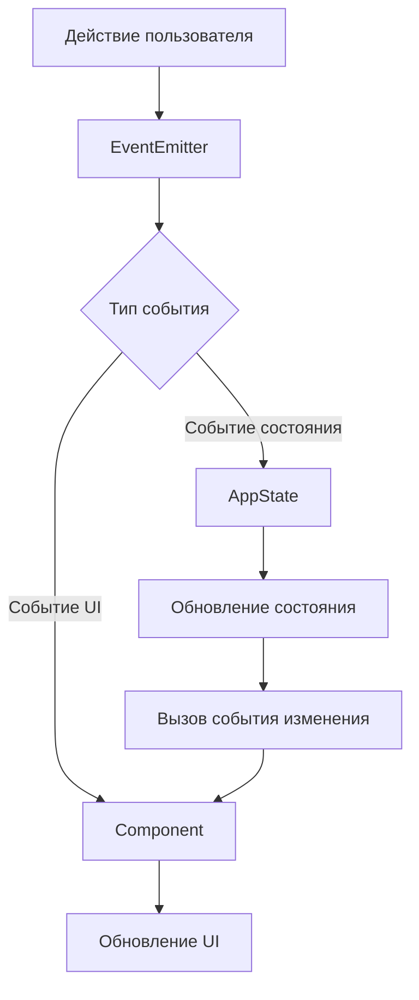
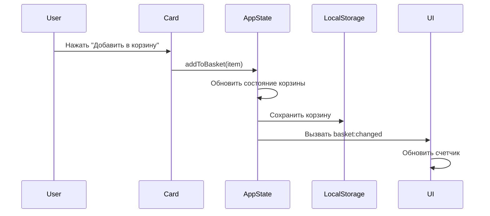

# Web Larek Frontend

Веб-приложение на TypeScript для магазина товаров для разработчиков, где пользователи могут просматривать и покупать товары, используя виртуальную валюту под названием "синапс". Этот проект демонстрирует современные практики фронтенд-разработки с использованием TypeScript, архитектуры, основанной на событиях, и компонентного дизайна.

🔗 **Демо**: [Web Larek Frontend](https://olliekse.github.io/web-larek-frontend/)


_Скриншот магазина Web Larek, показывающий различные товары для разработчиков с их ценами в синапсах_

## Особенности

- 🎨 Интерактивный каталог продуктов с категориями
- 🛒 Корзина покупок в реальном времени с сохранением в localStorage
- 💳 Многошаговый процесс оформления заказа
- 📱 Адаптивный дизайн
- 🔍 Модальные предварительные просмотры продуктов
- ✨ Чистый и современный интерфейс

## Технологический стек

- **TypeScript** (^5.0.4) - Основной язык программирования
- **Webpack** (^5.81.0) - Модульная сборка и разработка
- **SCSS** (^1.62.1) - Стилизация (с использованием методологии BEM)
- **Архитектура, основанная на событиях** - Для коммуникации между компонентами
- **LocalStorage** - Для сохранения корзины

## Начало работы

### Предварительные требования

- Node.js (v16 или выше)
- npm или yarn

### Установка

1. Клонируйте репозиторий:

```bash
git clone https://github.com/olliekse/web-larek-frontend.git
cd web-larek-frontend
```

2. Установите зависимости:

```bash
npm install
# или
yarn install
```

3. Запустите сервер разработки:

```bash
npm start
# или
yarn start
```

4. Сборка для продакшена:

```bash
npm run build
# или
yarn build
```

### Доступные скрипты

- `npm start` - Запускает сервер разработки
- `npm run build` - Сборка для продакшена
- `npm run lint` - Запускает ESLint
- `npm run format` - Форматирует код с помощью Prettier
- `npm run deploy` - Развёртывание на GitHub Pages

## Архитектура проекта

Проект следует компонентной архитектуре с коммуникацией между компонентами, основанной на событиях. Вот обзор основных архитектурных элементов:

Архитектура основана на двух ключевых принципах:

- **Изоляция компонентов**: Каждый UI-элемент (карточки, формы, модальные окна) является независимым модулем со своей логикой и зоной ответственности
- **Событийное взаимодействие**: Компоненты обмениваются данными через централизованную систему событий, а не напрямую

Пример типичного взаимодействия:

1. Компонент Card отправляет событие "add-to-basket" при выборе товара
2. Компонент AppData обрабатывает изменение состояния и отправляет событие "basket:changed"
3. Компонент Basket, подписанный на "basket:changed", обновляет свое отображение

Такой подход обеспечивает ряд преимуществ:

- Слабая связанность между компонентами
- Улучшенная поддерживаемость благодаря возможности независимой модификации компонентов
- Четкий поток данных через приложение
- Упрощенное тестирование благодаря четко определенному взаимодействию компонентов

### Диаграмма классов


_Диаграмма классов UML, показывающая отношения и структуру основных компонентов_

Диаграмма показывает:

- **Иерархия компонентов**: Все UI-компоненты наследуются от базового класса Component
- **Управление состоянием**: AppData управляет данными приложения и изменениями состояния
- **Интеграция API**: LarekAPI обрабатывает всю коммуникацию с бэкендом
- **Система событий**: EventEmitter позволяет компонентам общаться между собой
- **UI-компоненты**: Card, Modal, Basket и Form обрабатывают взаимодействие с пользователем

### Система компонентов

#### Базовые компоненты

##### EventEmitter

Основная система обработки событий, которая позволяет компонентам общаться между всеми частями приложения.

```typescript
class EventEmitter {
	// Карта имен событий на функции обратного вызова
	private events: Map<string, Set<Callback>>;

	// Регистрирует функцию обратного вызова для конкретного события
	on(event: string, callback: Function): void;

	// Удаляет зарегистрированную функцию обратного вызова
	off(event: string, callback: Function): void;

	// Вызывает событие с необязательными данными
	emit(event: string, data?: any): void;
}
```

##### Component

Абстрактный базовый класс для всех UI-компонентов в приложении. Обеспечивает общую функциональность для рендеринга и обработки событий.

```typescript
abstract class Component<T> {
	// Корневой DOM-элемент
	protected container: HTMLElement;

	// Ссылка на систему событий
	protected events: IEvents;

	// Безопасно обновляет текстовое содержимое
	protected setText(element: HTMLElement, value: unknown): void;

	// Устанавливает источник изображения с обработкой ошибок
	protected setImage(
		element: HTMLImageElement,
		src: string,
		alt?: string
	): void;

	// Управляет состоянием отключения
	protected setDisabled(element: HTMLElement, state: boolean): void;

	// Вызывает события через систему событий
	protected emit(event: string, payload?: object): void;

	// Рендерит содержимое компонента
	abstract render(data?: T): HTMLElement;
}
```

##### Model

Базовый класс для всех моделей данных в приложении. Реализует управление состоянием с безопасными обновлениями типов.

```typescript
abstract class Model<T> {
	// Система событий для трансляции изменений состояния
	protected events: IEvents;

	// Контейнер состояния с безопасными типами
	private state: T;

	// Создает новую модель с начальным состоянием и системой событий
	constructor(data: Partial<T>, events: IEvents);

	// Получает текущее состояние
	public getState(): T;

	// Обновляет состояние новыми данными
	protected updateState(newState: T): void;

	// Уведомляет подписчиков об изменениях состояния
	protected emitChanges(event: string): void;
}
```

#### Основные компоненты

##### AppData

Центральный компонент управления состоянием, который обрабатывает все данные приложения. Управляет каталогом продуктов, корзиной покупок, состоянием предварительного просмотра и обработкой заказов.

```typescript
class AppData extends Model<IAppState> {
	// Обновляет каталог продуктов и уведомляет подписчиков
	setCatalog(items: IProduct[]): void;

	// Добавляет продукт в корзину покупок
	addToBasket(item: IProduct): void;

	// Удаляет продукт из корзины по ID
	removeFromBasket(id: string): void;

	// Очищает все товары из корзины
	clearBasket(): void;

	// Устанавливает продукт для предварительного просмотра
	setPreview(item: IProduct | null): void;

	// Обновляет конкретное поле в форме заказа
	setOrderField(field: keyof IAppState['order'], value: string | number): void;

	// Проверяет текущие данные заказа
	validateOrder(): Partial<Record<keyof IAppState['order'], string>>;
}
```

##### Card

Компонент для отображения информации о продукте в различных контекстах. Обрабатывает разные режимы отображения: просмотр каталога, предварительный просмотр и элемент корзины.

```typescript
class Card extends Component<ICard> {
	// Элемент, отображающий название продукта
	protected _title: HTMLElement;

	// Необязательный элемент изображения продукта
	protected _image?: HTMLImageElement;

	// Элемент, показывающий категорию продукта
	protected _category?: HTMLElement;

	// Элемент, отображающий цену продукта
	protected _price: HTMLElement;

	// Интерактивная кнопка для действий с карточкой
	protected _button?: HTMLButtonElement;

	// Обновляет уникальный идентификатор карточки
	set id(value: string);

	// Устанавливает название продукта
	set title(value: string);

	// Обновляет источник изображения продукта
	set image(value: string);

	// Управляет состоянием выбора карточки
	set selected(value: boolean);

	// Управляет состоянием отключения карточки
	set disabled(value: boolean);

	// Форматирует и отображает цену продукта
	protected setPrice(value: number | null): void;

	// Устанавливает категорию и применяет соответствующее стилизование
	protected setCategory(value: string): void;

	// Рендерит карточку с предоставленными данными о продукте
	render(data: ICard): HTMLElement;
}
```

##### PreviewCard

Расширенная версия компонента Card для детального просмотра продуктов. Добавляет возможность отображения описания, сохраняя всю базовую функциональность карточки.

```typescript
class PreviewCard extends Card {
	// Элемент для отображения подробного описания продукта
	protected _description: HTMLElement;

	// Создает карточку предварительного просмотра с поддержкой описания
	constructor(container: HTMLElement, actions?: ICardActions);

	// Устанавливает текст описания продукта
	set description(value: string);

	// Обновляет видимость описания
	protected setDescriptionVisible(visible: boolean): void;

	// Рендерит карточку предварительного просмотра с полными данными о продукте
	render(data: ICard & { description?: string }): HTMLElement;
}
```

##### Modal

Компонент модального окна для отображения контента в оверлее. Обрабатывает открытие, закрытие и управление контентом с правильной блокировкой прокрутки.

```typescript
class Modal extends Component<IModalData> {
	// Кнопка для закрытия модального окна
	protected _closeButton: HTMLButtonElement;

	// Контейнер для контента модального окна
	protected _content: HTMLElement;

	// Внешний контейнер для позиционирования модального окна
	protected _container: HTMLElement;

	// Создает модальное окно с кнопкой закрытия и обработчиками событий
	constructor(container: HTMLElement, events: IEvents);

	// Обновляет элемент контента модального окна
	set content(value: HTMLElement);

	// Открывает модальное окно и блокирует прокрутку страницы
	open(): void;

	// Закрывает модальное окно и восстанавливает прокрутку страницы
	close(): void;

	// Рендерит модальное окно с предоставленным контентом
	render(data: IModalData): HTMLElement;
}
```

##### Form

Компонент формы, который обрабатывает проверку ввода пользователя и отправку данных. Поддерживает как формы заказа, так и контактной информации с проверкой в реальном времени.

```typescript
class Form extends Component<IFormState> {
	// Кнопка отправки, которая запускает отправку формы
	protected _submit: HTMLButtonElement;

	// Контейнер для сообщений об ошибках валидации
	protected _errors: HTMLElement;

	// Коллекция кнопок выбора метода оплаты
	protected _paymentButtons: NodeListOf<HTMLButtonElement>;

	// Поля ввода для данных пользователя
	protected _address: HTMLInputElement;
	protected _email: HTMLInputElement;
	protected _phone: HTMLInputElement;

	// Набор текущих ошибок валидации
	protected _validationErrors: Set<string>;

	// Основной элемент формы
	protected _form: HTMLFormElement;

	// Создает экземпляр формы и настраивает обработчики валидации
	constructor(container: HTMLElement, events: IEvents);

	// Проверяет все поля формы и обновляет состояние
	protected validateForm(): void;

	// Обрабатывает изменения в полях ввода с проверкой
	protected handleInput(event: Event): void;

	// Обрабатывает отправку формы с проверкой
	protected handleSubmit(event: Event): void;

	// Обновляет состояние кнопки отправки в зависимости от валидности
	set valid(value: boolean);

	// Обновляет отображение сообщений об ошибках
	set errors(value: string[]);

	// Рендерит форму с текущим состоянием
	render(state: IFormState): HTMLElement;
}
```

##### Success

Компонент для отображения успешного завершения заказа. Показывает сводку заказа и детали подтверждения.

```typescript
class Success extends Component<ISuccessProps> {
	// Элемент, отображающий общую сумму
	protected _total: HTMLElement;

	// Элемент, показывающий идентификатор заказа
	protected _id: HTMLElement;

	// Создает компонент сообщения об успешном заказе
	constructor(container: HTMLElement);

	// Устанавливает общую сумму с правильным форматированием
	protected setTotal(value: number): void;

	// Устанавливает идентификатор заказа
	protected setId(value: string): void;

	// Рендерит сообщение об успешном заказе с деталями заказа
	render(data: ISuccessProps): HTMLElement;
}
```

##### Basket

Компонент корзины покупок, который управляет отображением выбранных товаров и общей суммой.

```typescript
class Basket extends Component<IBasketView> {
	// Счетчик, показывающий количество товаров
	protected _counter: HTMLElement;

	// Элемент, отображающий общую сумму
	protected _total: HTMLElement;

	// Контейнер для товаров в корзине
	protected _items: HTMLElement;

	// Создает компонент корзины с обработчиками событий
	constructor(container: HTMLElement, events: IEvents);

	// Обновляет отображение счетчика товаров
	protected setCount(value: number): void;

	// Обновляет отображение общей суммы
	protected setTotal(value: number): void;

	// Рендерит корзину с текущими товарами и общей суммой
	render(data: IBasketView): HTMLElement;
}
```

##### Page

Основной компонент страницы, который организует макет и управляет глобальными элементами интерфейса.

```typescript
class Page extends Component<IPageState> {
	// Контейнер для каталога продуктов
	protected _catalog: HTMLElement;

	// Экземпляр корзины покупок
	protected _basket: Basket;

	// Экземпляр модального окна
	protected _modal: Modal;

	// Создает компонент страницы и инициализирует подкомпоненты
	constructor(container: HTMLElement, events: IEvents);

	// Обновляет отображение каталога с карточками продуктов
	set catalog(items: HTMLElement[]);

	// Показывает/скрывает индикатор загрузки
	protected toggleLoader(show: boolean): void;

	// Рендерит страницу с начальным состоянием
	render(data: IPageState): HTMLElement;
}
```

## Техническая справка

### Взаимодействие компонентов

Ниже представлена визуализация того, как компоненты взаимодействуют в различных сценариях:



#### Пример: Добавление в корзину



### Примеры реализации

#### 1. Просмотр и предварительный просмотр продуктов

```typescript
// Шаг 1: Инициализация отображения каталога
events.on('items:changed', () => {
	const state = appData.getState();
	page.catalog = state.catalog.map((item) => createProductCard(item));
});

// Шаг 2: Создание карточки продукта с обработчиком клика
function createProductCard(item: IProduct) {
	return new Card(cardTemplate, {
		onClick: () => {
			appData.setPreview(item);
			modal.open();
		},
	}).render(item);
}

// Шаг 3: Обработка изменений состояния предварительного просмотра
events.on('preview:changed', () => {
	const state = appData.getState();
	if (state.preview) {
		showProductPreview(state.preview);
	}
});

// Шаг 4: Отображение предварительного просмотра продукта
function showProductPreview(item: IProduct) {
	const previewCard = new PreviewCard(previewTemplate, {
		onClick: () => appData.addToBasket(item),
	});
	modal.render({ content: previewCard.render(item) });
}

// Шаг 5: Обработка закрытия предварительного просмотра
modal.on('close', () => {
	appData.setPreview(null);
});
```

#### 2. Обработка форм и валидация

```typescript
// Шаг 1: Инициализация формы с валидацией
class OrderForm extends Form {
	constructor(container: HTMLElement, events: IEvents) {
		super(container, events);
		this.setupValidation();
	}

	// Шаг 2: Настройка правил валидации полей
	private setupValidation() {
		const rules = {
			email: (value: string) => /^[^\s@]+@[^\s@]+\.[^\s@]+$/.test(value),
			phone: (value: string) => /^\+?[\d\s-]{10,}$/.test(value),
			address: (value: string) => value.length >= 10,
		};
		this.setValidationRules(rules);
	}

	// Шаг 3: Проверка отдельных полей
	protected validateField(field: HTMLInputElement): boolean {
		const value = field.value.trim();
		if (!value && field.required) return false;
		return this.rules[field.name]?.(value) ?? true;
	}

	// Шаг 4: Обработка отправки формы
	protected handleSubmit(event: Event) {
		event.preventDefault();
		if (this.validateForm()) {
			this.emit('submit', this.getFormData());
		}
	}

	// Шаг 5: Отображение результатов валидации
	protected showValidationResults() {
		const errors = Array.from(this._validationErrors);
		this.errors = errors;
		this.valid = errors.length === 0;
	}
}
```

#### 3. Управление корзиной покупок

```typescript
// Шаг 1: Добавление товара в корзину
function addToBasket(item: IProduct) {
	appData.addToBasket(item);
	localStorage.setItem('basket', JSON.stringify(appData.getState().basket));
}

// Шаг 2: Обновление отображения корзины
events.on('basket:changed', () => {
	const state = appData.getState();
	updateBasketUI(state.basket);
	updateTotalPrice(state.basket);
});

// Шаг 3: Расчет общей суммы
function updateTotalPrice(items: IProduct[]) {
	const total = items.reduce((sum, item) => sum + item.price, 0);
	appData.setOrderField('total', total);
}

// Шаг 4: Удаление товара из корзины
function removeFromBasket(id: string) {
	appData.removeFromBasket(id);
	localStorage.setItem('basket', JSON.stringify(appData.getState().basket));
}

// Шаг 5: Обработка процесса оформления заказа
function initiateCheckout() {
	if (appData.getState().basket.length > 0) {
		modal.render({ content: new OrderForm(formTemplate, events) });
		modal.open();
	}
}
```

#### 4. Обработка заказов

```typescript
// Шаг 1: Сбор данных заказа
function prepareOrderData(): IOrder {
	const state = appData.getState();
	return {
		items: state.basket.map((item) => item.id),
		total: calculateTotal(state.basket),
		...state.order,
	};
}

// Шаг 2: Проверка данных заказа
function validateOrder(order: IOrder): string[] {
	const errors = appData.validateOrder();
	return Object.values(errors);
}

// Шаг 3: Отправка заказа на бэкенд
async function submitOrder(order: IOrder) {
	try {
		const response = await api.createOrder(order);
		handleOrderSuccess(response);
	} catch (error) {
		handleOrderError(error);
	}
}

// Шаг 4: Обработка успешного заказа
function handleOrderSuccess(response: IOrderResult) {
	appData.clearBasket();
	localStorage.removeItem('basket');
	showSuccessMessage(response);
}

// Шаг 5: Очистка после заказа
function showSuccessMessage(response: IOrderResult) {
	const success = new Success(successTemplate);
	modal.render({
		content: success.render({ total: response.total }),
	});
}
```

### Система событий и справка по API

Приложение использует события для коммуникации между компонентами. Вот полная справка:

#### События состояния

| Имя события     | Данные                                 | Описание                                            |
| --------------- | -------------------------------------- | --------------------------------------------------- |
| items:changed   | `IProduct[]`                           | Обновлен каталог продуктов                          |
| preview:changed | `IProduct \| null`                     | Установлен/очищен предварительный просмотр продукта |
| basket:changed  | `{ items: IProduct[], total: number }` | Изменена корзина покупок                            |
| order:changed   | `IOrder`                               | Обновлены детали заказа                             |

#### События действий пользователя

| Имя события     | Данные                                 | Описание                     |
| --------------- | -------------------------------------- | ---------------------------- |
| input           | `{ field: string, value: string }`     | Изменено поле формы          |
| submit          | `{ payment: string, address: string }` | Отправлена форма заказа      |
| contacts:submit | `{ email: string, phone: string }`     | Отправлены контактные данные |

### Интеграция API

#### Api

Базовый класс для коммуникации с API. Предоставляет методы для выполнения HTTP-запросов и обработки ответов.

```typescript
class Api {
	// Базовый URL для конечных точек API
	readonly baseUrl: string;

	// Опции запроса по умолчанию
	protected options: RequestInit;

	// Создает экземпляр API с базовым URL и опциями по умолчанию
	constructor(baseUrl: string, options: RequestInit = {});

	// Выполняет GET-запрос к указанной конечной точке
	protected get(uri: string): Promise<unknown>;

	// Выполняет POST-запрос с данными к указанной конечной точке
	protected post(uri: string, data: object): Promise<unknown>;

	// Обрабатывает ответ API и проверку ошибок
	protected handleResponse(response: Response): Promise<unknown>;
}
```

#### LarekAPI

Клиент API, который обрабатывает всю коммуникацию с бэкендом. Управляет получением продуктов и отправкой заказов.

```typescript
class LarekAPI extends Api {
	// Базовый URL для изображений продуктов
	readonly cdn: string;

	// Создает клиент API с CDN и конечными точками API
	constructor(cdn: string, baseUrl: string, options?: RequestInit);

	// Получает и обрабатывает список продуктов
	getProductList(): Promise<IProduct[]>;

	// Отправляет заказ на бэкенд
	createOrder(order: IOrder): Promise<IOrderResult>;

	// Добавляет URL CDN к изображениям продуктов
	private addCdnUrl(items: IProduct[]): IProduct[];
}
```

### Структура проекта

```
src/
├── components/          # Основные компоненты
│   ├── base/           # Базовые классы
│   │   ├── Component.ts    # Базовый UI-компонент
│   │   ├── events.ts      # Система событий
│   │   └── Model.ts       # Управление состоянием
│   ├── common/         # Общие компоненты
│   ├── AppData.ts      # Состояние приложения
│   ├── Card.ts         # Компонент карточки продукта
│   ├── LarekAPI.ts     # Клиент API
│   ├── Order.ts        # Управление заказами
│   └── Page.ts         # Макет страницы
├── types/              # Определения TypeScript
│   ├── index.ts        # Экспорты типов
│   ├── api.ts          # Типы API
│   └── common.ts       # Общие типы
├── utils/              # Утилитарные функции
│   ├── constants.ts    # Глобальные константы
│   └── utils.ts        # Вспомогательные функции
└── index.ts           # Точка входа приложения
```

## Руководство по разработке

1. **Обработка событий**

   - Используйте события для коммуникации между компонентами
   - Поддерживайте согласованность имен событий
   - Документируйте данные событий

2. **Управление состоянием**

   - Изменяйте состояние только через AppData
   - Используйте события для реакции на изменения состояния
   - Сохраняйте необходимые данные в localStorage

3. **Разработка компонентов**

   - Держите компоненты сфокусированными и с одной целью
   - Используйте интерфейсы TypeScript для свойств
   - Следуйте установленному жизненному циклу компонентов

4. **Стиль кода**
   - Используйте возможности TypeScript по назначению
   - Следуйте конфигурациям ESLint и Prettier
   - Пишите ясный, самодокументирующийся код
