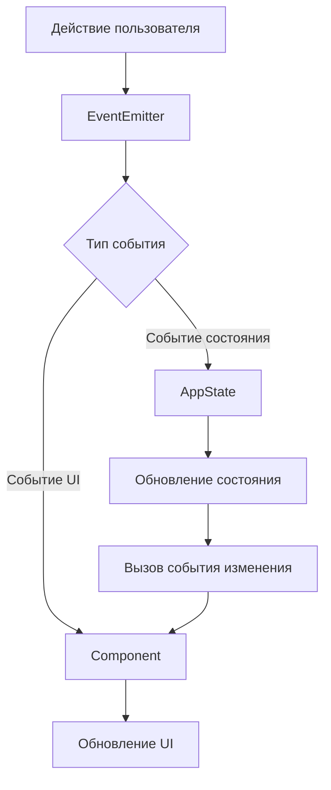
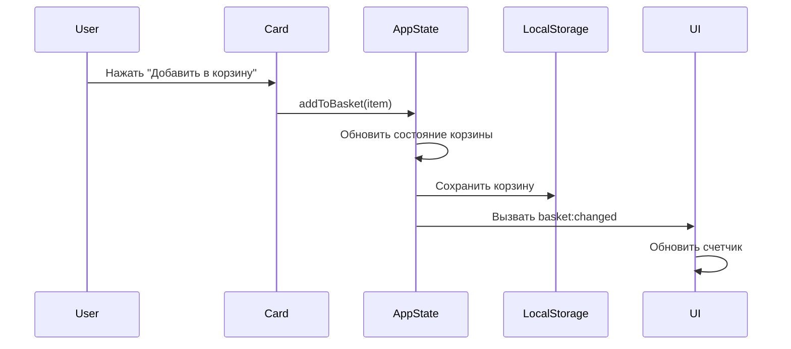

# Web Larek Frontend

Веб-приложение на TypeScript для магазина товаров для разработчиков, где пользователи могут просматривать и покупать товары, используя виртуальную валюту под названием "синапс". Этот проект демонстрирует современные практики фронтенд-разработки с использованием TypeScript, архитектуры, основанной на событиях, и компонентного дизайна.

🔗 **Демо**: [Web Larek Frontend](https://olliekse.github.io/web-larek-frontend/)


_Скриншот магазина Web Larek, показывающий различные товары для разработчиков с их ценами в синапсах_

## Особенности

- 🎨 Интерактивный каталог продуктов с категориями
- 🛒 Корзина покупок в реальном времени с сохранением в localStorage
- 💳 Многошаговый процесс оформления заказа
- 📱 Адаптивный дизайн
- 🔍 Модальные предварительные просмотры продуктов
- ✨ Чистый и современный интерфейс

## Технологический стек

- **TypeScript** (^5.0.4) - Основной язык программирования
- **Webpack** (^5.81.0) - Модульная сборка и разработка
- **SCSS** (^1.62.1) - Стилизация (с использованием методологии BEM)
- **Архитектура, основанная на событиях** - Для коммуникации между компонентами
- **LocalStorage** - Для сохранения корзины

## Начало работы

### Предварительные требования

- Node.js (v16 или выше)
- npm или yarn

### Установка

1. Клонируйте репозиторий:

```bash
git clone https://github.com/olliekse/web-larek-frontend.git
cd web-larek-frontend
```

2. Установите зависимости:

```bash
npm install
# или
yarn install
```

3. Запустите сервер разработки:

```bash
npm start
# или
yarn start
```

4. Сборка для продакшена:

```bash
npm run build
# или
yarn build
```

### Доступные скрипты

- `npm start` - Запускает сервер разработки
- `npm run build` - Сборка для продакшена
- `npm run lint` - Запускает ESLint
- `npm run format` - Форматирует код с помощью Prettier
- `npm run deploy` - Развёртывание на GitHub Pages

## Архитектура проекта

Проект следует компонентной архитектуре с коммуникацией между компонентами, основанной на событиях. Вот обзор основных архитектурных элементов:

Архитектура основана на двух ключевых принципах:

- **Изоляция компонентов**: Каждый UI-элемент (карточки, формы, модальные окна) является независимым модулем со своей логикой и зоной ответственности
- **Событийное взаимодействие**: Компоненты обмениваются данными через централизованную систему событий, а не напрямую

Пример типичного взаимодействия:

1. Компонент Card отправляет событие "add-to-basket" при выборе товара
2. Компонент AppData обрабатывает изменение состояния и отправляет событие "basket:changed"
3. Компонент Basket, подписанный на "basket:changed", обновляет свое отображение

Такой подход обеспечивает ряд преимуществ:

- Слабая связанность между компонентами
- Улучшенная поддерживаемость благодаря возможности независимой модификации компонентов
- Четкий поток данных через приложение
- Упрощенное тестирование благодаря четко определенному взаимодействию компонентов

### Диаграмма классов


_Диаграмма классов UML, показывающая отношения и структуру основных компонентов_

Диаграмма показывает:

- **Иерархия компонентов**: Все UI-компоненты наследуются от базового класса Component
- **Управление состоянием**: AppData управляет данными приложения и изменениями состояния
- **Интеграция API**: LarekAPI обрабатывает всю коммуникацию с бэкендом
- **Система событий**: EventEmitter позволяет компонентам общаться между собой
- **UI-компоненты**: Card, Modal, Basket и Form обрабатывают взаимодействие с пользователем

### Система компонентов

#### Базовые компоненты

##### EventEmitter

Основная система обработки событий, которая позволяет компонентам общаться между всеми частями приложения. Поддерживает сопоставление шаблонов с помощью RegExp для имен событий.

```typescript
type EventName = string | RegExp;
type Subscriber = Function;
type EmitterEvent = {
	eventName: string;
	data: unknown;
};

export interface IEvents {
	on<T extends object>(event: EventName, callback: (data: T) => void): void;
	emit<T extends object>(event: string, data?: T): void;
	trigger<T extends object>(
		event: string,
		context?: Partial<T>
	): (data: T) => void;
}

export class EventEmitter implements IEvents {
	_events: Map<EventName, Set<Subscriber>>;

	constructor() {
		this._events = new Map<EventName, Set<Subscriber>>();
	}

	// Установка обработчика события с поддержкой строк и RegExp шаблонов
	on<T extends object>(eventName: EventName, callback: (event: T) => void) {
		if (!this._events.has(eventName)) {
			this._events.set(eventName, new Set<Subscriber>());
		}
		this._events.get(eventName)?.add(callback);
	}

	// Удаление обработчика события
	off(eventName: EventName, callback: Subscriber) {
		if (this._events.has(eventName)) {
			this._events.get(eventName)!.delete(callback);
			if (this._events.get(eventName)?.size === 0) {
				this._events.delete(eventName);
			}
		}
	}

	// Вызов события с данными, поддержка сопоставления шаблонов
	emit<T extends object>(eventName: string, data?: T) {
		this._events.forEach((subscribers, name) => {
			if (name === '*')
				subscribers.forEach((callback) =>
					callback({
						eventName,
						data,
					})
				);
			if (
				(name instanceof RegExp && name.test(eventName)) ||
				name === eventName
			) {
				subscribers.forEach((callback) => callback(data));
			}
		});
	}

	// Прослушивание всех событий с помощью wildcard
	onAll(callback: (event: EmitterEvent) => void) {
		this.on('*', callback);
	}

	// Сброс всех обработчиков
	offAll() {
		this._events = new Map<EventName, Set<Subscriber>>();
	}

	// Создание триггера, генерирующего событие при вызове
	trigger<T extends object>(eventName: string, context?: Partial<T>) {
		return (event: object = {}) => {
			this.emit(eventName, {
				...(event || {}),
				...(context || {}),
			});
		};
	}
}
```

Ключевые особенности:

- Сопоставление шаблонов с помощью RegExp для имен событий
- Прослушивание всех событий с помощью '\*'
- Типобезопасная обработка данных событий
- Поддержка контекста событий в триггерах

##### Component

Абстрактный базовый класс для всех UI-компонентов в приложении. Обеспечивает общую функциональность для рендеринга и обработки событий с надежной типобезопасностью и проверкой ошибок.

```typescript
export abstract class Component<T> {
	/** Корневой DOM-элемент компонента */
	protected container: HTMLElement;
	/** Эмиттер событий для коммуникации компонентов */
	protected events: IEvents;

	/**
	 * Создает новый экземпляр компонента
	 * @param {HTMLElement} container - Корневой элемент для этого компонента
	 * @param {IEvents} [events] - Опциональный эмиттер событий для коммуникации компонентов
	 */
	constructor(container: HTMLElement, events?: IEvents) {
		this.container = container;
		this.events = events;
	}

	/**
	 * Устанавливает текстовое содержимое HTML-элемента с проверкой на null
	 */
	protected setText(element: HTMLElement, value: unknown) {
		if (element) {
			element.textContent = String(value);
		}
	}

	/**
	 * Устанавливает источник и альтернативный текст для элемента изображения с валидацией
	 */
	protected setImage(element: HTMLImageElement, src: string, alt?: string) {
		if (element) {
			element.src = src;
			if (alt) {
				element.alt = alt;
			}
		}
	}

	/**
	 * Устанавливает или удаляет атрибут disabled у HTML-элемента
	 */
	protected setDisabled(element: HTMLElement, state: boolean) {
		if (element) {
			if (state) {
				element.setAttribute('disabled', 'disabled');
			} else {
				element.removeAttribute('disabled');
			}
		}
	}

	/**
	 * Отправляет событие через эмиттер событий компонента с типобезопасностью
	 */
	protected emit(event: string, payload?: object) {
		if (this.events) {
			this.events.emit(event, payload);
		}
	}

	/**
	 * Рендерит компонент с предоставленными данными
	 * Должен быть реализован каждым классом компонента
	 */
	abstract render(data?: Partial<T>): HTMLElement;
}
```

Ключевые особенности:

- Параметр обобщенного типа для данных компонента
- Проверка на null и валидация для операций с DOM
- Типобезопасная отправка событий
- Защищенные вспомогательные методы для общих операций с DOM

##### Model

Базовый класс для всех моделей данных в приложении. Реализует управление состоянием с типобезопасными обновлениями и отправкой событий.

```typescript
/**
 * Проверка типа для определения, является ли объект экземпляром Model
 */
export const isModel = (obj: unknown): obj is Model<any> => {
	return obj instanceof Model;
};

export abstract class Model<T> {
	/** Эмиттер событий для изменений состояния модели */
	protected events: IEvents;
	/** Внутреннее хранилище состояния */
	private state: T;

	/**
	 * Создает новый экземпляр модели
	 * @param {Partial<T>} data - Начальные данные состояния
	 * @param {IEvents} events - Эмиттер событий для изменений состояния
	 */
	constructor(data: Partial<T>, events: IEvents) {
		this.state = data as T;
		this.events = events;
	}

	/**
	 * Получает текущее состояние модели
	 */
	public getState(): T {
		return this.state;
	}

	/**
	 * Обновляет состояние модели
	 */
	protected updateState(newState: T) {
		this.state = newState;
	}

	/**
	 * Отправляет событие изменения состояния
	 */
	protected emitChanges(event: string) {
		this.events.emit(event);
	}
}
```

Ключевые особенности:
- Параметр обобщенного типа для данных состояния
- Проверка типа во время выполнения
- Защищенные методы мутации состояния
- Обновления состояния на основе событий
- Паттерн неизменяемого состояния

Пример реализации (AppData):
```typescript
export class AppData extends Model<IAppState> {
	// Типы действий для мутаций состояния
	export enum ActionType {
		SET_CATALOG = 'SET_CATALOG',
		ADD_TO_BASKET = 'ADD_TO_BASKET',
		REMOVE_FROM_BASKET = 'REMOVE_FROM_BASKET',
		CLEAR_BASKET = 'CLEAR_BASKET',
		SET_PREVIEW = 'SET_PREVIEW',
		UPDATE_ORDER = 'UPDATE_ORDER',
	}

	private dispatch(
		type: ActionType,
		payload: IProduct[] | IProduct | string | OrderUpdatePayload | null
	) {
		// Обновления состояния с соответствующими событиями
		const eventMap: Record<ActionType, string> = {
			[ActionType.SET_CATALOG]: 'items:changed',
			[ActionType.ADD_TO_BASKET]: 'basket:changed',
			[ActionType.REMOVE_FROM_BASKET]: 'basket:changed',
			[ActionType.CLEAR_BASKET]: 'basket:changed',
			[ActionType.SET_PREVIEW]: 'preview:changed',
			[ActionType.UPDATE_ORDER]: 'order:changed',
		};

		// Обновление состояния и отправка события изменения
		this.updateState({
			...this.getState(),
			...newState,
		});
		this.emitChanges(eventMap[type]);
	}
}
```

#### Основные компоненты

##### AppData

Центральный компонент управления состоянием, который обрабатывает все данные приложения. Управляет каталогом продуктов, корзиной покупок, состоянием предварительного просмотра и обработкой заказов.

```typescript
class AppData extends Model<IAppState> {
	// Обновляет каталог продуктов и уведомляет подписчиков
	setCatalog(items: IProduct[]): void;

	// Добавляет продукт в корзину покупок
	addToBasket(item: IProduct): void;

	// Удаляет продукт из корзины по ID
	removeFromBasket(id: string): void;

	// Очищает все товары из корзины
	clearBasket(): void;

	// Устанавливает продукт для предварительного просмотра
	setPreview(item: IProduct | null): void;

	// Обновляет конкретное поле в форме заказа
	setOrderField(field: keyof IAppState['order'], value: string | number): void;

	// Проверяет текущие данные заказа
	validateOrder(): Partial<Record<keyof IAppState['order'], string>>;
}
```

##### Card

Компонент для отображения информации о продукте в различных контекстах. Обрабатывает разные режимы отображения: просмотр каталога, предварительный просмотр и элемент корзины.

```typescript
class Card extends Component<ICard> {
	// Элемент, отображающий название продукта
	protected _title: HTMLElement;

	// Необязательный элемент изображения продукта
	protected _image?: HTMLImageElement;

	// Элемент, показывающий категорию продукта
	protected _category?: HTMLElement;

	// Элемент, отображающий цену продукта
	protected _price: HTMLElement;

	// Интерактивная кнопка для действий с карточкой
	protected _button?: HTMLButtonElement;

	// Обновляет уникальный идентификатор карточки
	set id(value: string);

	// Устанавливает название продукта
	set title(value: string);

	// Обновляет источник изображения продукта
	set image(value: string);

	// Управляет состоянием выбора карточки
	set selected(value: boolean);

	// Управляет состоянием отключения карточки
	set disabled(value: boolean);

	// Форматирует и отображает цену продукта
	protected setPrice(value: number | null): void;

	// Устанавливает категорию и применяет соответствующее стилизование
	protected setCategory(value: string): void;

	// Рендерит карточку с предоставленными данными о продукте
	render(data: ICard): HTMLElement;
}
```

##### PreviewCard

Расширенная версия компонента Card для детального просмотра продуктов. Добавляет возможность отображения описания, сохраняя всю базовую функциональность карточки.

```typescript
class PreviewCard extends Card {
	// Элемент для отображения подробного описания продукта
	protected _description: HTMLElement;

	// Создает карточку предварительного просмотра с поддержкой описания
	constructor(container: HTMLElement, actions?: ICardActions);

	// Устанавливает текст описания продукта
	set description(value: string);

	// Обновляет видимость описания
	protected setDescriptionVisible(visible: boolean): void;

	// Рендерит карточку предварительного просмотра с полными данными о продукте
	render(data: ICard & { description?: string }): HTMLElement;
}
```

##### Modal

Компонент модального окна для отображения контента в оверлее. Обрабатывает открытие, закрытие и управление контентом с правильной блокировкой прокрутки.

```typescript
class Modal extends Component<IModalData> {
	// Кнопка для закрытия модального окна
	protected _closeButton: HTMLButtonElement;

	// Контейнер для контента модального окна
	protected _content: HTMLElement;

	// Внешний контейнер для позиционирования модального окна
	protected _container: HTMLElement;

	// Создает модальное окно с кнопкой закрытия и обработчиками событий
	constructor(container: HTMLElement, events: IEvents);

	// Обновляет элемент контента модального окна
	set content(value: HTMLElement);

	// Открывает модальное окно и блокирует прокрутку страницы
	open(): void;

	// Закрывает модальное окно и восстанавливает прокрутку страницы
	close(): void;

	// Рендерит модальное окно с предоставленным контентом
	render(data: IModalData): HTMLElement;
}
```

##### Form

Компонент формы, который обрабатывает валидацию пользовательского ввода и отправку данных. Поддерживает как формы заказа, так и контактной информации с валидацией в реальном времени и обработкой ошибок.

```typescript
interface IFormState {
	valid: boolean; // Является ли форма валидной в данный момент
	errors: string[]; // Список сообщений об ошибках валидации
}

export class Form extends Component<IFormState> {
	protected _submit: HTMLButtonElement; // Кнопка отправки формы
	protected _errors: HTMLElement; // Контейнер для сообщений об ошибках
	protected _paymentButtons: NodeListOf<HTMLButtonElement>; // Кнопки выбора способа оплаты
	protected _address: HTMLInputElement; // Поле ввода адреса доставки
	protected _email: HTMLInputElement; // Поле ввода email
	protected _phone: HTMLInputElement; // Поле ввода телефона
	protected _validationErrors: Set<string>; // Текущие ошибки валидации
	protected _form: HTMLFormElement; // Сам элемент формы

	constructor(container: HTMLElement, events: IEvents) {
		super(container, events);

		// Инициализация элементов формы с использованием утилиты ensureElement
		this._submit = ensureElement<HTMLButtonElement>(
			'.form__submit',
			this.container
		);
		this._errors = ensureElement<HTMLElement>('.form__errors', this.container);
		this._paymentButtons = this.container.querySelectorAll('.form__radio');
		this._address = ensureElement<HTMLInputElement>(
			'input[name="address"]',
			this.container
		);
		this._email = ensureElement<HTMLInputElement>(
			'input[name="email"]',
			this.container
		);
		this._phone = ensureElement<HTMLInputElement>(
			'input[name="phone"]',
			this.container
		);
		this._form = ensureElement<HTMLFormElement>('form', this.container);
		this._validationErrors = new Set();

		// Настройка обработчиков событий
		this._form.addEventListener('input', this.handleInput.bind(this));
		this._form.addEventListener('submit', this.handleSubmit.bind(this));
	}

	protected handleInput(event: Event) {
		const target = event.target as HTMLInputElement;
		const field = target.name;
		const value = target.value;

		this.emit('input', { field, value });
		this.validateForm();
	}

	protected handleSubmit(event: Event) {
		event.preventDefault();
		this.validateForm();
		if (this._validationErrors.size === 0) {
			this.emit('submit');
		}
	}

	set valid(value: boolean) {
		this.setDisabled(this._submit, !value);
	}

	set errors(value: string[]) {
		this._validationErrors = new Set(value);
		this.setText(this._errors, value.join(', '));
	}

	render(state: Partial<IFormState>): HTMLElement {
		const { valid, errors } = state;
		if (valid !== undefined) {
			this.valid = valid;
		}
		if (errors !== undefined) {
			this.errors = errors;
		}
		return this.container;
	}
}
```

Ключевые особенности:

- Валидация ввода в реальном времени
- Управление сообщениями об ошибках
- Выбор способа оплаты
- Обработка отправки формы
- Типобезопасная отправка событий
- Использование утилиты для безопасного выбора элементов

##### Success

Компонент для отображения успешного завершения заказа. Показывает сводку заказа и детали подтверждения с функцией закрытия.

```typescript
interface ISuccess {
	total: number; // Общая сумма в синапсах
}

export class Success extends Component<ISuccess> {
	protected _close: HTMLElement; // Элемент кнопки закрытия
	protected _total: HTMLElement; // Элемент отображения общей суммы

	constructor(container: HTMLElement, events: IEvents) {
		super(container, events);

		// Инициализация элементов с использованием утилиты ensureElement
		this._close = ensureElement<HTMLElement>(
			'.order-success__close',
			this.container
		);
		this._total = ensureElement<HTMLElement>(
			'.order-success__description',
			this.container
		);

		// Настройка обработчика кнопки закрытия
		if (this._close) {
			this._close.addEventListener('click', () => {
				this.events.emit('success:close');
			});
		}
	}

	/**
	 * Обновляет отображаемую общую сумму с форматированием валюты
	 */
	set total(total: number) {
		this.setText(this._total, `Списано ${total} синапсов`);
	}

	/**
	 * Рендерит сообщение об успешном заказе с общей суммой
	 */
	render(data: ISuccess): HTMLElement {
		this.total = data.total;
		return this.container;
	}
}
```

Ключевые особенности:

- Безопасный выбор элементов с помощью утилиты
- Форматирование суммы с указанием валюты
- Функциональность кнопки закрытия
- Отправка события при закрытии
- Типобезопасная обработка данных

##### Basket

Компонент корзины покупок, который управляет отображением выбранных товаров и общей суммой. Обрабатывает инициацию процесса оформления заказа.

```typescript
interface IBasketView {
	items: HTMLElement[]; // Массив отрендеренных элементов товаров
	total: number; // Общая цена в синапсах
}

export class Basket extends Component<IBasketView> {
	protected _list: HTMLElement; // Контейнер для товаров корзины
	protected _total: HTMLElement; // Отображение общей суммы
	protected _button: HTMLButtonElement; // Кнопка оформления заказа

	constructor(container: HTMLElement, events: IEvents) {
		super(container, events);

		// Инициализация элементов с использованием утилиты ensureElement
		this._list = ensureElement<HTMLElement>('.basket__list', this.container);
		this._total = ensureElement<HTMLElement>('.basket__price', this.container);
		this._button = ensureElement<HTMLButtonElement>(
			'.basket__button',
			this.container
		);

		// Настройка обработчика кнопки оформления заказа
		if (this._button) {
			this._button.addEventListener('click', () => {
				events.emit('basket:checkout');
			});
		}
	}

	/**
	 * Обновляет список товаров в корзине
	 * Отключает кнопку оформления заказа, если корзина пуста
	 */
	set items(items: HTMLElement[]) {
		this._list.replaceChildren(...items);
		this.setDisabled(this._button, items.length === 0);
	}

	/**
	 * Рендерит корзину с товарами и общей суммой
	 */
	render(data: IBasketView): HTMLElement {
		if (data.items) {
			this.items = data.items;
		}
		if (data.total !== undefined) {
			this.setText(this._total, `${data.total} синапсов`);
		}
		return this.container;
	}
}
```

Ключевые особенности:

- Безопасный выбор элементов с помощью утилиты
- Динамическое управление списком товаров
- Автоматическое управление состоянием кнопки
- Форматирование валюты
- Инициация процесса оформления заказа
- Типобезопасная отправка событий

##### Page

Основной компонент страницы, который организует макет и управляет глобальными элементами интерфейса. Обрабатывает отображение каталога, счетчик корзины покупок и обертку страницы.

```typescript
interface IPage {
	counter: number; // Количество товаров в корзине
	catalog: HTMLElement[]; // Массив элементов карточек товаров
}

export class Page extends Component<IPage> {
	protected _counter: HTMLElement; // Элемент счетчика корзины
	protected _catalog: HTMLElement; // Контейнер галереи товаров
	protected _wrapper: HTMLElement; // Обертка основной страницы

	constructor(container: HTMLElement, events: IEvents) {
		super(container);

		// Инициализация элементов страницы
		this._counter = container.querySelector('.header__basket-counter');
		this._catalog = container.querySelector('.gallery');
		this._wrapper = container.querySelector('.page__wrapper');

		// Настройка слушателей событий для счетчика и каталога
		if (events) {
			events.on('counter:changed', this.setCounter.bind(this));
			events.on('catalog:changed', this.setCatalog.bind(this));
		}
	}

	/**
	 * Обновляет отображение счетчика корзины
	 */
	set counter(value: number) {
		this.setText(this._counter, value.toString());
	}

	/**
	 * Обновляет отображение каталога товаров
	 * Заменяет все текущие карточки новыми
	 */
	set catalog(items: HTMLElement[]) {
		this._catalog.replaceChildren(...items);
	}

	/**
	 * Обработчик событий обновления счетчика
	 */
	protected setCounter(value: number) {
		this.counter = value;
	}

	/**
	 * Обработчик событий обновления каталога
	 */
	protected setCatalog(items: HTMLElement[]) {
		this.catalog = items;
	}

	/**
	 * Рендерит страницу с предоставленными данными
	 */
	render(data: Partial<IPage>): HTMLElement {
		if (data.counter !== undefined) {
			this.counter = data.counter;
		}
		if (data.catalog) {
			this.catalog = data.catalog;
		}
		return this.container;
	}
}
```

Ключевые особенности:

- Автоматическое обновление счетчика через систему событий
- Динамическое управление каталогом
- Управление оберткой страницы для макета
- Обновления на основе событий для счетчика и каталога

## Техническая справка

### Взаимодействие компонентов

Ниже представлена визуализация того, как компоненты взаимодействуют в различных сценариях:



#### Пример: Добавление в корзину



### Примеры реализации

#### 1. Загрузка и предварительный просмотр продуктов

```typescript
// Этап 1: Инициализация API и получение списка продуктов
api
	.getProductList()
	.then((items) => {
		appData.setCatalog(items);
		const state = appData.getState();

		// Этап 2: Создание шаблона карточки для каждого продукта
		const cards = state.catalog.map((item) => {
			const cardElement = cardCatalogTemplate.content.cloneNode(
				true
			) as HTMLElement;

			// Этап 3: Настройка обработчика клика для предпросмотра
			const card = new Card(cardElement.firstElementChild as HTMLElement, {
				onClick: () => {
					appData.setPreview(item);
					modal.open();
				},
			});

			// Этап 4: Отрисовка карточки с данными продукта
			return card.render({
				title: item.title,
				image: item.image,
				price: item.price,
				category: item.category,
			});
		});

		// Этап 5: Обновление каталога страницы всеми карточками
		page.catalog = cards;
	})
	.catch(console.error);
```

#### 2. Управление корзиной покупок

```typescript
events.on('basket:changed', () => {
	// Этап 1: Получение текущего состояния и обновление счетчика
	const state = appData.getState();
	page.counter = state.basket.length;

	// Этап 2: Создание элементов карточек для товаров в корзине
	const basketItems = state.basket.map((item) => {
		const cardElement = basketItemTemplate.content.cloneNode(
			true
		) as HTMLElement;

		// Этап 3: Настройка функционала удаления
		const card = new Card(cardElement.firstElementChild as HTMLElement, {
			onDelete: () => {
				appData.removeFromBasket(item.id);
			},
		});

		// Этап 4: Отрисовка отдельного товара в корзине
		return card.render({
			title: item.title,
			price: item.price,
			category: item.category,
		});
	});

	// Этап 5: Обновление UI корзины и сохранение в хранилище
	const basketTotal = state.basket.reduce((sum, item) => sum + item.price, 0);
	basketModal.render({
		content: basket.render({
			items: basketItems,
			total: basketTotal,
		}),
	});
	localStorage.setItem('basket', JSON.stringify(state.basket));
});
```

#### 3. Обработка заказов

```typescript
events.on('contacts:submit', (data: { email: string; phone: string }) => {
	// Этап 1: Обновление полей заказа контактной информацией
	appData.setOrderField('email', data.email);
	appData.setOrderField('phone', data.phone);

	// Этап 2: Подготовка данных заказа
	const state = appData.getState();
	const orderData = {
		...state.order,
		items: state.basket.map((item) => item.id),
		total: state.basket.reduce((sum, item) => sum + item.price, 0),
	};

	// Этап 3: Отправка заказа в API
	api
		.createOrder(orderData)
		.then((result) => {
			// Этап 4: Обработка успешного заказа
			orderModal.close();
			successModal.render({
				content: success.render({
					total: result.total,
				}),
			});
			successModal.open();

			// Этап 5: Очистка после успешного заказа
			appData.clearBasket();
		})
		.catch(console.error);
});
```

#### 4. Обработка форм и валидация

```typescript
events.on('input', (data: { field: string; value: string }) => {
	// Этап 1: Проверка типа поля и обновление состояния
	if (
		data.field === 'email' ||
		data.field === 'phone' ||
		data.field === 'address'
	) {
		appData.setOrderField(data.field, data.value);
	}

	// Этап 2: Валидация формы
	const errors = appData.validateOrder();

	// Этап 3: Обновление состояния формы
	orderForm.render({
		valid: Object.keys(errors).length === 0,
		errors: Object.values(errors),
	});
});
```

#### 5. Инициализация приложения

```typescript
// Этап 1: Создание экземпляра системы событий
const events = new EventEmitter();

// Этап 2: Инициализация API клиента
const api = new LarekAPI(CDN_URL, API_URL);

// Этап 3: Инициализация хранилища данных
const appData = new AppData({ basket: [] }, events);

// Этап 4: Восстановление корзины из localStorage
const basketData = localStorage.getItem('basket');
if (basketData) {
	const basket = JSON.parse(basketData);
	basket.forEach((item: IProduct) => {
		appData.addToBasket(item);
	});
}

// Этап 5: Загрузка начальных данных
api
	.getProductList()
	.then((items) => {
		appData.setCatalog(items);
	})
	.catch(console.error);
```

### Система событий и справка по API

Приложение использует события для коммуникации между компонентами. Вот полная справка:

#### События состояния

| Имя события     | Данные                                 | Описание                                            |
| --------------- | -------------------------------------- | --------------------------------------------------- |
| items:changed   | `IProduct[]`                           | Обновлен каталог продуктов                          |
| preview:changed | `IProduct \| null`                     | Установлен/очищен предварительный просмотр продукта |
| basket:changed  | `{ items: IProduct[], total: number }` | Изменена корзина покупок                            |
| order:changed   | `IOrder`                               | Обновлены детали заказа                             |

#### События действий пользователя

| Имя события     | Данные                                 | Описание                     |
| --------------- | -------------------------------------- | ---------------------------- |
| input           | `{ field: string, value: string }`     | Изменено поле формы          |
| submit          | `{ payment: string, address: string }` | Отправлена форма заказа      |
| contacts:submit | `{ email: string, phone: string }`     | Отправлены контактные данные |

### Интеграция API

#### Api

Базовый класс для коммуникации с API. Предоставляет методы для выполнения HTTP-запросов и обработки ответов.

```typescript
/**
 * Общий тип для ответов API со списками
 */
export type ApiListResponse<Type> = {
	total: number;
	items: Type[];
};

/**
 * Допустимые HTTP-методы для POST-подобных операций
 */
export type ApiPostMethods = 'POST' | 'PUT' | 'DELETE';

/**
 * Базовый класс API-клиента
 * Предоставляет общую функциональность для выполнения HTTP-запросов
 */
export class Api {
	/** Базовый URL для всех API-запросов */
	readonly baseUrl: string;
	/** Параметры запросов по умолчанию */
	protected options: RequestInit;

	/**
	 * Создает новый экземпляр API-клиента
	 * @param {string} baseUrl - Базовый URL для всех API-запросов
	 * @param {RequestInit} [options={}] - Параметры fetch по умолчанию
	 */
	constructor(baseUrl: string, options: RequestInit = {}) {
		this.baseUrl = baseUrl;
		this.options = {
			headers: {
				'Content-Type': 'application/json',
				...((options.headers as object) ?? {}),
			},
		};
	}

	/**
	 * Обрабатывает ответ API
	 * Автоматически парсит JSON и обрабатывает ошибки
	 */
	protected handleResponse(response: Response): Promise<object> {
		if (response.ok) return response.json();
		else
			return response
				.json()
				.then((data) => Promise.reject(data.error ?? response.statusText));
	}

	/**
	 * Выполняет GET-запрос к API
	 */
	get(uri: string) {
		return fetch(this.baseUrl + uri, {
			...this.options,
			method: 'GET',
		}).then(this.handleResponse);
	}

	/**
	 * Выполняет POST, PUT или DELETE запрос к API
	 */
	post(uri: string, data: object, method: ApiPostMethods = 'POST') {
		return fetch(this.baseUrl + uri, {
			...this.options,
			method,
			body: JSON.stringify(data),
		}).then(this.handleResponse);
	}
}

/**
 * API-клиент для взаимодействия с бэкендом
 * Расширяет базовый класс Api специфичными методами для магазина Web Larek
 */
export class LarekAPI extends Api {
	readonly cdn: string;

	constructor(cdn: string, baseUrl: string, options?: RequestInit) {
		super(baseUrl, options);
		this.cdn = cdn;
	}

	/**
	 * Получает список продуктов из API
	 * Добавляет CDN URL к изображениям продуктов
	 */
	getProductList(): Promise<IProduct[]> {
		return this.get('/product').then((data: ApiListResponse<IProduct>) =>
			data.items.map((item) => ({
				...item,
				image: this.cdn + item.image,
			}))
		);
	}

	/**
	 * Создает новый заказ в системе
	 */
	createOrder(order: IOrder): Promise<IOrderResult> {
		return this.post('/order', order).then((data: IOrderResult) => data);
	}
}
```

### Структура проекта

```
src/
├── components/          # Основные компоненты
│   ├── base/           # Базовые классы
│   │   ├── Component.ts    # Базовый UI-компонент
│   │   ├── events.ts      # Система событий
│   │   └── Model.ts       # Управление состоянием
│   ├── common/         # Общие компоненты
│   ├── AppData.ts      # Состояние приложения
│   ├── Card.ts         # Компонент карточки продукта
│   ├── LarekAPI.ts     # Клиент API
│   ├── Order.ts        # Управление заказами
│   └── Page.ts         # Макет страницы
├── types/              # Определения TypeScript
│   ├── index.ts        # Экспорты типов
│   ├── api.ts          # Типы API
│   └── common.ts       # Общие типы
├── utils/              # Утилитарные функции
│   ├── constants.ts    # Глобальные константы
│   └── utils.ts        # Вспомогательные функции
└── index.ts           # Точка входа приложения
```

## Руководство по разработке

1. **Обработка событий**

   - Используйте события для коммуникации между компонентами
   - Поддерживайте согласованность имен событий
   - Документируйте данные событий

2. **Управление состоянием**

   - Изменяйте состояние только через AppData
   - Используйте события для реакции на изменения состояния
   - Сохраняйте необходимые данные в localStorage

3. **Разработка компонентов**

   - Держите компоненты сфокусированными и с одной целью
   - Используйте интерфейсы TypeScript для свойств
   - Следуйте установленному жизненному циклу компонентов

4. **Стиль кода**
   - Используйте возможности TypeScript по назначению
   - Следуйте конфигурациям ESLint и Prettier
   - Пишите ясный, самодокументирующийся код
