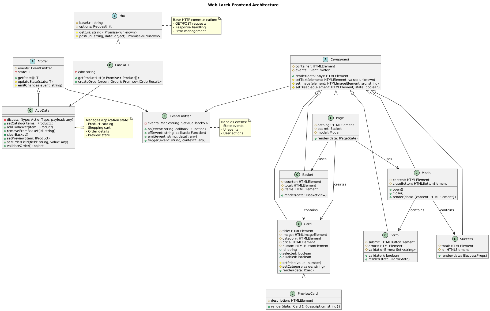

# Web Larek Frontend

## Содержание

1. [Описание проекта](#описание-проекта)
2. [Реализация паттерна MVP](#реализация-паттерна-mvp)
   - [Обзор](#обзор)
   - [Поток коммуникации](#поток-коммуникации)
   - [Преимущества](#преимущества)
   - [UML-диаграмма классов](#uml-диаграмма-классов)
3. [Ключевые особенности](#ключевые-особенности)
4. [Технический стек](#технический-стек)
5. [Начало работы](#начало-работы)
   - [Установка](#установка)
   - [Настройка разработки](#настройка-разработки)
6. [Структура проекта](#структура-проекта)
7. [Документация классов](#документация-классов)
   - [Базовые классы](#базовые-классы)
   - [Модели](#модели)
   - [Представления](#представления)
   - [Презентеры](#презентеры)
8. [Система событий](#система-событий)
   - [События корзины](#-события-корзины)
   - [События модального окна](#-события-модального-окна)
   - [События продуктов](#️-события-продуктов)
   - [События форм](#-события-форм)
9. [API слой](#api-слой)
10. [Рекомендации по разработке](#рекомендации-по-разработке)
    - [Разработка компонентов](#разработка-компонентов)
    - [Стиль кода](#стиль-кода)
    - [Тестирование](#тестирование)
11. [Примеры взаимодействия](#примеры-взаимодействия)
    - [Добавление товара в корзину](#1-добавление-товара-в-корзину)
    - [Валидация формы при оформлении заказа](#2-валидация-формы-при-оформлении-заказа)
    - [Открытие модального окна с деталями продукта](#3-открытие-модального-окна-с-деталями-продукта)

---

## Описание проекта

Магазин мерчендайза для разработчиков, где пользователи могут тратить "синапсы" (виртуальную валюту) на тематические товары для разработчиков. Построен с использованием TypeScript и архитектуры MVP, включает адаптивную галерею, функциональность корзины и валидацию форм.

🔗 **Живая версия**: https://olliekse.github.io/web-larek-frontend/

## Реализация паттерна MVP

Этот проект реализует архитектурный паттерн Model-View-Presenter (MVP) для разделения ответственности и улучшения поддерживаемости:

### Обзор

Приложение разделено на три основных слоя:

1. **Слой Model**: Обрабатывает бизнес-логику и управление данными

- Управляет состоянием приложения
   - Обрабатывает валидацию данных
   - Генерирует события изменения состояния

2. **Слой View**: Обрабатывает отображение UI и взаимодействие с пользователем

- Отрисовывает UI компоненты
   - Обрабатывает пользовательский ввод
   - Генерирует события взаимодействия

3. **Слой Presenter**: Координирует работу между Models и Views
   - Обрабатывает бизнес-логику
   - Обновляет Models на основе событий View
   - Обновляет Views на основе изменений Model

### Поток коммуникации

1. **Пользователь → View**: Пользователь взаимодействует с элементами UI
2. **View → Presenter**: View генерирует события, которые обрабатывает Presenter
3. **Presenter → Model**: Presenter вызывает методы Model для обновления данных
4. **Model → Presenter**: Model генерирует события с обновленным состоянием
5. **Presenter → View**: Presenter обновляет View новыми данными

### Преимущества

1. **Разделение ответственности**

- Четкие границы между слоями
   - Каждый слой имеет единственную ответственность

2. **Тестируемость**

- Компоненты можно тестировать изолированно
   - Легко создавать моки зависимостей

3. **Поддерживаемость**

- Изменения в одном слое не влияют на другие
   - Четкие границы ответственности

4. **Переиспользуемость**
   - Компоненты можно переиспользовать
   - Гибкая архитектура для будущих изменений

Подробную реализацию каждого компонента смотрите в [Документации классов](#документация-классов).
Подробности о системе событий смотрите в [Основные концепции - Система событий](#система-событий).

### UML-диаграмма классов

Следующая диаграмма иллюстрирует отношения между основными классами приложения:



Диаграмма показывает:

- Иерархии классов и отношения наследования
- Взаимодействия и зависимости компонентов
- Поток событий между компонентами
- Структуру реализации паттерна MVP

---

## Ключевые особенности

- 🎨 Адаптивная галерея продуктов с динамическими обновлениями
- 🛒 Управление корзиной в реальном времени с валютой "синапсы"
- 📝 Многошаговая форма заказа с валидацией
- 🔄 Управление состоянием с событийно-ориентированными обновлениями
- 💳 Несколько способов оплаты (карта/наличные)
- 📱 Адаптивный дизайн
- 🔌 Типобезопасное взаимодействие с API и обработка ошибок

---

## Технический стек

- **TypeScript** - Основной язык программирования
- **SCSS** - Стилизация с методологией BEM
- **Webpack** - Сборка модулей и сервер разработки
- **Event-Driven Architecture** - Пользовательская система событий для коммуникации компонентов
- **MVP Pattern** - Архитектурный паттерн Model-View-Presenter

---

## Начало работы

### Установка

```bash
# Установка зависимостей
npm install

# Запуск сервера разработки
npm run start

# Сборка для продакшена
npm run build
```

### Настройка разработки

```bash
# Клонирование репозитория
git clone https://github.com/olliekse/web-larek-frontend.git

# Установка зависимостей
npm install

# Запуск сервера разработки
npm run start

# Сборка для продакшена
npm run build

# Запуск тестов
npm run test

# Проверка кода
npm run lint
```

---

## Структура проекта

```
web-larek-frontend/
├── src/
│   ├── components/        # Компоненты приложения (представления, модели, презентеры)
│   ├── services/         # Реализации сервисного слоя
│   │   ├── api/         # Реализации API сервисов
│   │   └── DOMService.ts # Сервис для работы с DOM
│   ├── utils/            # Вспомогательные функции и утилиты
│   ├── common.blocks/    # Общие блочные компоненты
│   ├── config/           # Конфигурационные файлы
│   ├── constants/        # Константы и перечисления
│   ├── images/           # Изображения
│   ├── pages/            # Шаблоны страниц
│   ├── public/           # Публичные ассеты
│   ├── scss/            # SCSS стили
│   ├── types/           # TypeScript определения типов
│   ├── vendor/          # Сторонние библиотеки
│   └── index.ts         # Точка входа приложения
```

---

## Документация классов

### Базовые классы

1. **BasePresenter**

- **Назначение**: Служит основой для всех презентеров в паттерне MVP, обеспечивая общую функциональность обработки событий и управления жизненным циклом. Выступает в роли моста между Models и Views.
   - **Поля**:
     - `protected events: IEvents` - Экземпляр системы событий
   - **Методы**:
     - `constructor(events: IEvents)` - Инициализирует презентер с системой событий
     - `protected init(): void` - Шаблонный метод для инициализации
     - `protected destroy(): void` - Очистка и отписка от событий

2. **Card**

- **Назначение**: Предоставляет переиспользуемую основу для всех компонентов карточек продуктов, обрабатывая общие манипуляции с DOM, управление шаблонами и стилизацию категорий. Обеспечивает единообразное отображение карточек во всем приложении.
   - **Поля**:
     - `protected elements: CardElements` - Ссылки на DOM элементы
     - `protected template: HTMLTemplateElement` - Шаблон карточки
     - `protected domService: IDOMService` - Сервис манипуляции с DOM
   - **Методы**:
     - `protected initializeElements(): void` - Настраивает ссылки на DOM элементы
     - `render(data: IProduct): HTMLElement` - Создает элемент карточки
     - `protected getCategoryClass(category: string): string` - Сопоставляет категорию с CSS классом

3. **EventEmitter**
   - **Назначение**: Реализует надежную систему событий, обеспечивающую слабосвязанную коммуникацию между компонентами. Управляет подпиской, отпиской и генерацией событий на протяжении жизненного цикла приложения.
   - **Поля**:
     - `private events: Record<string, EventHandler[]>` - Хранилище обработчиков событий
   - **Методы**:
     - `on(event: string, handler: EventHandler): void` - Подписывается на событие
     - `off(event: string, handler: EventHandler): void` - Отписывается от события
     - `emit(event: string, data?: unknown): void` - Вызывает обработчики событий
     - `trigger(event: string): Function` - Создает функцию-триггер события

### Модели

1. **AppState**

- **Назначение**: Выступает в роли центральной системы управления состоянием для всего приложения, поддерживая данные о продуктах, состоянии корзины, состояниях загрузки и видимости модальных окон. Обеспечивает согласованные обновления состояния и уведомления между компонентами.
   - **Поля**:
     - `private state` - Содержит:
       - `cart: { items: IProduct[] }` - Товары корзины с сохранением в localStorage
       - `modal: IModal` - Состояние модального окна
       - `products: IProduct[]` - Хранилище списка продуктов
       - `loading: LoadingState` - Состояния загрузки для разных операций
       - `error: string | null` - Глобальное состояние ошибки
   - **Методы**:
     - `setProducts(products: IProduct[]): void` - Обновляет список продуктов
     - `getProducts(): IProduct[]` - Получает список продуктов
     - `addToCart(product: IProduct): void` - Добавляет продукт в корзину с сохранением
     - `removeFromCart(productId: string): void` - Удаляет товар из корзины
     - `getCart(): CartState` - Получает текущее состояние корзины с вычисляемой суммой
     - `clearCart(): void` - Очищает корзину и обновляет localStorage
     - `isProductInCart(productId: string): boolean` - Проверяет наличие продукта в корзине
     - `setLoading(type: keyof LoadingState, value: boolean): void` - Обновляет состояние загрузки
     - `isLoading(type: keyof LoadingState): boolean` - Проверяет конкретное состояние загрузки
     - `isAnyLoading(): boolean` - Проверяет наличие любой активной загрузки
     - `setError(message: string | null): void` - Устанавливает состояние ошибки
     - `private calculateCartTotal(): number` - Вычисляет текущую сумму корзины

2. **FormModel**

- **Назначение**: Управляет валидацией и состоянием данных формы. Обрабатывает базовую валидацию для проверки заполненности обязательных полей перед отправкой.
   - **Поля**:
     - `protected payment: string` - Способ оплаты
     - `protected email: string` - Email пользователя
     - `protected phone: string` - Телефон пользователя
     - `protected address: string` - Адрес доставки
     - `protected formErrors: FormErrors` - Хранилище ошибок валидации
   - **Методы**:
     - `setOrderData(field: string, value: string): void` - Обновляет данные формы
     - `validateContacts(): boolean` - Проверяет заполненность контактных полей
     - `validateOrder(): boolean` - Проверяет заполненность полей заказа
     - `getOrderLot(orderData: IOrderData): IOrder` - Подготавливает данные заказа для отправки
     - `resetForm(): void` - Сбрасывает все поля формы и ошибки
     - Защищенные сеттеры:
       - `protected setEmail(value: string): void` - Валидирует и устанавливает email
       - `protected setPhone(value: string): void` - Валидирует и устанавливает телефон
       - `protected setAddress(value: string): void` - Валидирует и устанавливает адрес

3. **OrderModel**
   - **Назначение**: Управляет полным жизненным циклом заказа, от сбора товаров до выбора способа оплаты и контактной информации. Обеспечивает целостность данных заказа и валидацию перед отправкой.
   - **Поля**:
     - `private orderData: IOrder` - Текущие данные заказа
     - `private items: string[]` - ID товаров заказа
     - `private paymentMethod: PaymentMethod` - Выбранный способ оплаты
   - **Методы**:
     - `setOrderItems(items: IProduct[]): void` - Обновляет товары заказа
     - `setPaymentMethod(method: PaymentMethod): void` - Устанавливает способ оплаты
     - `setContactInfo(info: ContactInfo): void` - Обновляет контактные данные
     - `getOrderData(): IOrder` - Получает полные данные заказа
     - `validateOrder(): boolean` - Проверяет полноту заказа

### Представления

1. **CardView**

- **Назначение**: Обеспечивает интерактивное отображение продукта, управляя как галерейным, так и модальным представлением, обрабатывая информацию о продукте и взаимодействие с корзиной.
   - **Конструктор**:
`typescript
     constructor(
         template: HTMLTemplateElement,
         protected events: IEvents,
         protected domService: IDOMService,
         protected appState: AppState,
         protected actions?: IActions
     )
     `
   - **Поля**:
     - `protected elements: { card: HTMLElement }` - Базовый элемент карточки
     - `protected button: HTMLButtonElement` - Кнопка действия корзины
     - `private currentProduct: IProduct` - Текущий отображаемый продукт
   - **Методы**:
     - `protected initializeElements(): void` - Настраивает элементы карточки
     - `render(data: IProduct): HTMLElement` - Создает карточку продукта
     - `updateButtonState(isInCart: boolean, canBePurchased: boolean): void` - Обновляет состояние кнопки
     - `renderModal(data: IProduct): HTMLElement` - Создает модальное представление

2. **Cart**

- **Назначение**: Предоставляет полный интерфейс корзины покупок, управляя отображением товаров, вычислением общей суммы и инициацией процесса оформления заказа.
   - **Поля**:
     - `protected _list: HTMLElement` - Контейнер для товаров
     - `protected _total: HTMLElement` - Отображение общей суммы
     - `protected _button: HTMLButtonElement` - Кнопка оформления заказа
     - `private _counter: HTMLElement` - Счетчик товаров в шапке
   - **Методы**:
     - `render(): HTMLElement` - Отрисовывает контейнер корзины
     - `renderItems(items: IProduct[]): void` - Обновляет отображение товаров
     - `renderSumAllProducts(total: number): void` - Обновляет общую сумму
     - `renderHeaderCartCounter(count: number): void` - Обновляет счетчик корзины
     - `updateTotal(total: number): void` - Обновляет отображение с вычисленной суммой
     - `clear(): void` - Очищает содержимое корзины

3. **OrderForm**

- **Назначение**: Обеспечивает процесс оформления заказа с вводом адреса, выбором способа оплаты и валидацией формы.
   - **Поля**:
     - `private _addressInput: HTMLInputElement` - Поле ввода адреса
     - `private _paymentButtons: HTMLButtonElement[]` - Кнопки выбора способа оплаты
     - `private _submitButton: HTMLButtonElement` - Кнопка отправки заказа
     - `private _errorDisplay: HTMLElement` - Отображение ошибок валидации
   - **Методы**:
     - `validateAddress(): boolean` - Проверяет валидность адреса
     - `setPaymentMethod(method: string): void` - Обновляет выбор способа оплаты
     - `showSuccess(): void` - Показывает сообщение об успехе

4. **ModalView**

- **Назначение**: Реализует гибкую систему модальных окон, способную отображать различные типы контента с единообразным стилем и поведением.
   - **Интерфейс**: `IModalView`
     - `open(): void` - Открывает модальное окно
     - `close(): void` - Закрывает модальное окно
     - `setContent(content: HTMLElement): void` - Обновляет содержимое модального окна
     - `setTitle(title: string): void` - Обновляет заголовок модального окна
   - **Поля**:
     - `protected _content: HTMLElement` - Контейнер содержимого
     - `protected _title: HTMLElement` - Элемент заголовка
     - `protected closeButton: HTMLButtonElement` - Кнопка закрытия
     - `protected pageWrapper: HTMLElement` - Обертка страницы для модального оверлея
   - **Методы**:
     - `constructor(container: HTMLElement, events: IEvents)` - Инициализирует модальное окно с проверкой ошибок
     - `open(): void` - Открывает модальное окно с анимацией
     - `close(): void` - Закрывает модальное окно с очисткой
     - `setContent(content: HTMLElement): void` - Безопасно обновляет содержимое
     - `setTitle(title: string): void` - Безопасно обновляет заголовок
   - **Обработка ошибок**:
     - Проверяет наличие необходимых элементов при инициализации
     - Выбрасывает описательные ошибки для отсутствующих элементов
     - Предотвращает всплытие событий для кликов по контейнеру модального окна

5. **ContactsView**
   - **Назначение**: Чистый компонент представления для формы контактов. Обрабатывает только отображение UI и захват пользовательского ввода.
   - **Поля**:
     - `private _form: HTMLFormElement` - Элемент формы
     - `private _button: HTMLButtonElement` - Кнопка отправки
     - `private _errors: HTMLElement` - Отображение ошибок
     - `private _inputs: HTMLInputElement[]` - Поля ввода формы
   - **Методы**:
     - `render(): HTMLElement` - Отрисовывает форму контактов
     - `resetForm(): void` - Сбрасывает состояние формы
     - `set valid(value: boolean)` - Обновляет состояние валидации
     - `set error(value: string)` - Отображает ошибки валидации

### Презентеры

1. **ProductPresenter**

- **Назначение**: Управляет функциональностью каталога продуктов, обрабатывая отображение продуктов, обновления состояния и взаимодействие с пользователем. Координирует работу между данными продуктов и их визуальным представлением.
   - **Поля**:
     - `private gallery: HTMLElement` - Контейнер галереи продуктов
     - `private appState: AppState` - Управление состоянием приложения
     - `private api: ProductApi` - Сервис API продуктов
   - **Методы**:
     - `async init(): Promise<void>`
       - Инициализирует отображение продуктов
       - Загружает продукты через API
       - Генерирует: `state:products:changed`
     - `private handleProductSelect(product: IProduct): void`
       - Открывает модальное окно с деталями продукта
       - Параметры:
         - `product`: Выбранный продукт
       - Генерирует: `modal:open`
     - `private updateProductStates(): void`
       - Обновляет состояния кнопок продуктов
       - Синхронизирует с состоянием корзины
       - Обновляет элементы UI

2. **CartPresenter**

- **Назначение**: Координирует все операции с корзиной покупок, управляя обновлениями состояния, удалением товаров и отображением корзины. Обеспечивает синхронизацию между представлением корзины и базовыми данными.
   - **Поля**:
     - `private appState: AppState` - Управление состоянием приложения
     - `private view: ICart` - Интерфейс корзины
     - `private modal: ModalView` - Сервис модальных окон
   - **Методы**:
     - `init(): void`
       - Настраивает слушатели корзины
       - Инициализирует состояние корзины
       - Обновляет счетчик корзины
     - `private handleCartOpen(): void`
       - Открывает модальное окно корзины
       - Обновляет отображение с вычисленной суммой
       - Генерирует: `modal:open`
     - `private handleItemRemove(productId: string): void`
       - Удаляет товар из корзины
       - Обновляет состояние корзины
       - Генерирует: `state:cart:changed`

3. **OrderPresenter**

- **Назначение**: Управляет полным процессом оформления заказа, координируя валидацию формы, сбор данных и коммуникацию с API. Обеспечивает плавный процесс оформления заказа.
   - **Поля**:
     - `private formModel: FormModel` - Данные формы заказа
     - `private api: ProductApi` - Сервис API
     - `private appState: AppState` - Управление состоянием приложения
   - **Методы**:
     - `init(): void`
       - Настраивает слушатели формы
       - Инициализирует валидацию
       - Подготавливает процесс заказа
     - `private handleSubmit(formData: IOrderForm): void`
       - Обрабатывает отправку заказа
       - Валидирует данные формы
       - Вызывает API для создания заказа
       - Генерирует: `order:success`
     - `private validateOrder(): boolean`
       - Проверяет валидность заказа
       - Валидирует все поля
       - Возвращает: Результат валидации
     - `private handlePaymentSelection(method: PaymentMethod): void`
       - Обновляет способ оплаты
       - Валидирует состояние формы
       - Обновляет UI соответственно

4. **ModalPresenter**

- **Назначение**: Управляет жизненным циклом модальных окон и управлением контентом, координируя работу между различными представлениями, требующими модального отображения. Управляет состоянием модальных окон и переходами.
   - **Поля**:
     - `private view: ModalView` - Экземпляр представления модального окна
     - `private currentContent: HTMLElement | null` - Текущий отображаемый контент
     - `private isOpen: boolean` - Отслеживание состояния модального окна
   - **Методы**:
     - `init(): void`
       - Настраивает слушатели событий модального окна
       - Инициализирует состояние представления
       - Подписывается на события
     - `private handleOpen(content: HTMLElement, title?: string): void`
       - Открывает модальное окно с контентом
       - Параметры:
         - `content`: Контент для отображения
         - `title`: Опциональный заголовок модального окна
       - Генерирует: `modal:opened`
     - `private handleClose(): void`
       - Закрывает модальное окно
       - Очищает контент
       - Генерирует: `modal:closed`

5. **ContactsPresenter**

- **Назначение**: Координирует сбор и валидацию контактной информации, управляя состоянием формы и валидацией пользовательского ввода. Обеспечивает валидность контактных данных перед обработкой заказа.
   - **Поля**:
     - `private formModel: FormModel` - Модель данных формы
     - `private view: ContactsView` - Представление формы контактов
     - `private api: ProductApi` - Сервис API
   - **Методы**:
     - `init(): void`
       - Настраивает валидацию формы
       - Инициализирует обработчики событий
       - Подготавливает состояние формы
     - `private handleSubmit(data: ContactInfo): void`
       - Обрабатывает отправку формы
       - Параметры:
         - `data`: Данные формы контактов
       - Валидирует ввод
       - Генерирует: `contacts:valid`
     - `private validateForm(): boolean`
       - Выполняет валидацию формы
       - Проверяет все обязательные поля
       - Возвращает: Общую валидность

6. **AppPresenter**
   - **Назначение**: Служит главным координатором приложения, инициализируя и управляя всеми остальными презентерами. Обрабатывает глобальное состояние, управление ошибками и высокоуровневый поток приложения.
   - **Поля**:
     - `private productPresenter: ProductPresenter` - Управление продуктами
     - `private cartPresenter: CartPresenter` - Операции корзины
     - `private orderPresenter: OrderPresenter` - Обработка заказов
     - `private modalPresenter: ModalPresenter` - Управление модальными окнами
     - `private appState: AppState` - Глобальное состояние
   - **Методы**:
     - `async init(): Promise<void>`
       - Инициализирует все презентеры
       - Настраивает глобальные обработчики событий
       - Загружает начальные данные
     - `private setupEventHandlers(): void`
       - Конфигурирует глобальную систему событий
       - Настраивает коммуникацию между презентерами
       - Обрабатывает изменения глобального состояния
     - `private handleError(error: Error): void`
       - Глобальный обработчик ошибок
       - Показывает сообщения об ошибках
       - Логирует ошибки соответствующим образом
     - `private loadInitialData(): Promise<void>`
       - Загружает начальные данные приложения
       - Обновляет глобальное состояние
       - Инициализирует представления

---

## Примеры взаимодействия

### 1. Добавление товара в корзину

```typescript
// 1. View: Обработка клика по кнопке
class CardView extends Card {
	protected initializeElements(): void {
		this.button.addEventListener('click', (e: Event) => {
			e.preventDefault();
			this.events.emit('card:addCart', this.currentProduct);
		});
	}
}

// 2. Presenter: Обработка события добавления
class ProductPresenter extends BasePresenter {
	constructor(private appState: AppState, private view: CardView) {
		super();
		this.events.on('card:addCart', this.handleAddToCart.bind(this));
	}

	private handleAddToCart(product: IProduct): void {
		this.appState.addToCart(product);
		this.updateButtonState(product.id, true);
	}
}
```

### 2. Валидация формы при оформлении заказа

```typescript
// View: Обработка ввода пользователя
class ContactsView {
	constructor() {
		this._emailInput.addEventListener('input', (e: Event) => {
			const email = (e.target as HTMLInputElement).value;
			this.events.emit('form:input', { field: 'email', value: email });
		});
	}
}

// Presenter: Логика валидации
class OrderPresenter extends BasePresenter {
	constructor(private formModel: FormModel, private view: ContactsView) {
		super();
		this.events.on('form:input', this.handleInput.bind(this));
	}

	private handleInput(data: { field: string; value: string }): void {
		this.formModel.setOrderData(data.field, data.value);
		const isValid = !this.formModel.validateOrder();
		this.view.valid = isValid;
	}
}

// Model: Правила валидации
class FormModel {
	validateOrder(): boolean {
		return !this.email || !this.phone || !this.address;
	}

	setOrderData(field: string, value: string): void {
		this[field] = value;
		this.events.emit('formData:changed', {
			field,
			value,
			isValid: !!value,
		});
	}
}
```

### 3. Открытие модального окна с деталями продукта

```typescript
// View: Обработка клика по карточке
class CardView extends Card {
	constructor() {
		this.container.addEventListener('click', () => {
			if (!event.target.closest('.button')) {
				this.events.emit('product:select', this.currentProduct);
			}
		});
	}
}

// Presenter: Открытие модального окна
class ProductPresenter extends BasePresenter {
	private handleProductSelect(product: IProduct): void {
		const modal = this.view.renderModal(product);
		this.events.emit('modal:open', { content: modal });
	}
}

// Model: Обновление состояния
class AppState {
	private modal: ModalState | null = null;

	public setModal(modal: ModalState): void {
		this.modal = modal;
		this.events.emit('state:modal:changed', this.modal);
	}
}

// View: Отображение модального окна
class ModalView {
	public open(content: HTMLElement): void {
		this.contentContainer.innerHTML = '';
		this.contentContainer.appendChild(content);
		this.container.classList.add('modal_active');
	}
}
```

Эти примеры демонстрируют:

- Четкое разделение ответственности между слоями MVP
- Событийно-ориентированную коммуникацию
- Однонаправленный поток данных
- Управление состоянием
- Обратную связь для пользователя

---

## Система событий

### 🛒 События корзины

- `cart:open` - Открытие модального окна корзины
- `cart:changed` - Изменение содержимого корзины
- `cart:removeItem` - Запрос на удаление товара из корзины
- `cart:state:get` - Запрос текущего состояния корзины

### 🔲 События модального окна

- `modal:open` - Открытие модального окна с контентом
- `modal:close` - Закрытие модального окна
- `modal:update` - Обновление содержимого модального окна

### 🏷️ События продуктов

- `card:select` - Выбор карточки продукта
- `card:addCart` - Запрос на добавление продукта в корзину

### 📝 События форм

- `order:ready` - Форма заказа валидна и готова
- `order:submit` - Отправка формы заказа
- `order:open` - Открытие формы заказа
- `order:paymentSelection` - Выбор способа оплаты

## API слой

API слой реализован с использованием базового API клиента, который обеспечивает:

- Типобезопасную обработку запросов/ответов
- Управление ошибками
- Аутентификацию
- Трансформацию ответов

Ключевые особенности API слоя:

- Централизованная обработка ошибок с типизацией
- Типизация запросов/ответов
- Четкое разделение базовой функциональности и конкретных реализаций
- Единообразная обработка ошибок во всех вызовах API

## Рекомендации по разработке

1. **Разработка компонентов**

- Следовать паттерну MVP
   - Использовать интерфейсы TypeScript
   - Реализовывать событийно-ориентированную коммуникацию
   - Использовать вычисляемые свойства вместо хранения значений
   - Применять protected/private поля для лучшей инкапсуляции

2. **Стиль кода**

- Использовать согласованные соглашения об именовании
   - Документировать публичные методы и интерфейсы
   - Следовать принципам SOLID
   - Избегать хранения вычисляемых значений
   - Поддерживать чистый код без отладочных логов в продакшене

3. **Тестирование**
   - Писать модульные тесты для бизнес-логики
   - Тестировать интеграцию компонентов
   - Проверять обработку событий

## Скриншот


Интерфейс приложения демонстрирует:

- Адаптивную галерею продуктов с категориями
- Интерактивную корзину с подсчетом стоимости
- Модальные окна с деталями продуктов
- Форму оформления заказа с валидацией
- Современный и чистый дизайн
